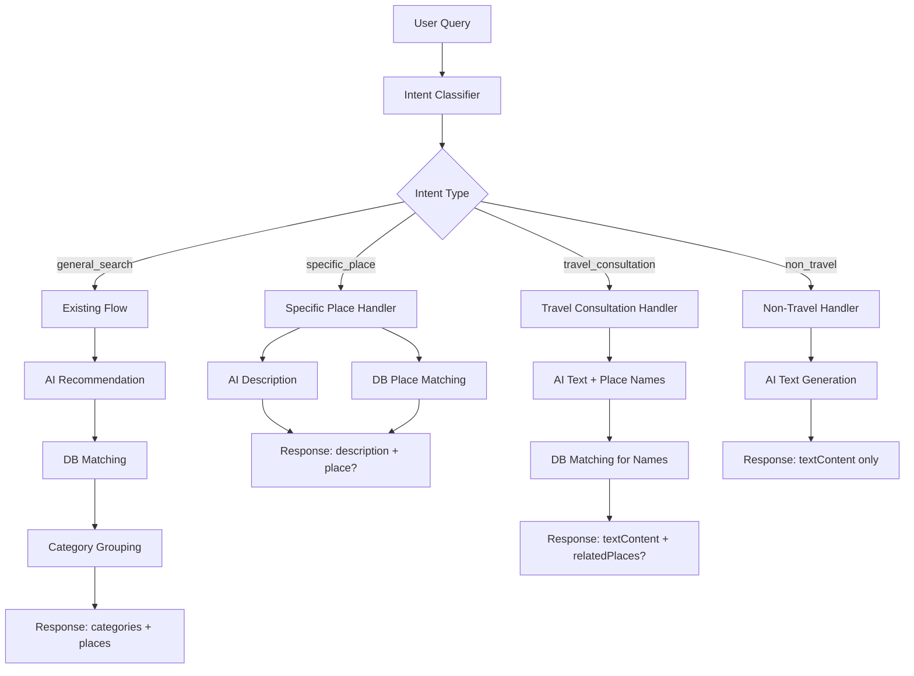

# Design Document: AI Intent Recognition

## Overview

扩展现有 AI 搜索系统，增加意图识别层，根据用户查询意图选择不同的处理流程。系统保持对现有 `general_search` 流程的完全兼容，同时新增三种意图类型的处理能力。

## Architecture



## Components and Interfaces

### Intent Classifier Service

```typescript
// 意图类型
type IntentType = 'general_search' | 'specific_place' | 'travel_consultation' | 'non_travel';

// 意图识别结果
interface IntentResult {
  intent: IntentType;
  placeName?: string;           // specific_place 时的地点名
  placeNames?: string[];        // travel_consultation 时提取的地点名列表
  city?: string;                // 识别到的城市
  category?: string;            // 识别到的分类
  count?: number;               // 识别到的数量
  confidence?: number;          // 置信度 0-1
}

// 意图分类器接口
interface IntentClassifier {
  classify(query: string, language: string): Promise<IntentResult>;
  fallbackClassify(query: string, language: string): IntentResult;
}
```

### Response Types

```typescript
// 统一响应基础结构
interface BaseSearchResponse {
  intent: IntentType;
  success: boolean;
  error?: string;
}

// general_search 响应（保持现有结构）
interface GeneralSearchResponse extends BaseSearchResponse {
  intent: 'general_search';
  acknowledgment: string;
  categories?: CategoryGroup[];
  places: PlaceResult[];
  requestedCount: number;
  exceededLimit: boolean;
}

// specific_place 响应
interface SpecificPlaceResponse extends BaseSearchResponse {
  intent: 'specific_place';
  description: string;          // AI 生成的介绍
  place?: PlaceResult;          // 匹配到的地点（可选）
}

// travel_consultation 响应
interface TravelConsultationResponse extends BaseSearchResponse {
  intent: 'travel_consultation';
  textContent: string;          // Markdown 格式的回答
  relatedPlaces?: PlaceResult[]; // 单城市：扁平数组，横滑展示
  cityPlaces?: CityPlacesGroup[]; // 多城市：按城市分组
}

// 城市地点分组（多城市场景）
interface CityPlacesGroup {
  city: string;                 // 城市名
  places: PlaceResult[];        // 该城市的相关地点（至少3个）
}

// non_travel 响应
interface NonTravelResponse extends BaseSearchResponse {
  intent: 'non_travel';
  textContent: string;          // Markdown 格式的回答
}

// 联合类型
type SearchResponse = GeneralSearchResponse | SpecificPlaceResponse | TravelConsultationResponse | NonTravelResponse;
```

### Intent Classification Prompt

```typescript
const INTENT_CLASSIFICATION_PROMPT = `Analyze this query and determine the user's intent.

Query: "{query}"

Classify into ONE of these intents:

1. "specific_place" - User wants info about a SPECIFIC named place
   Examples: "Eiffel Tower", "help me find Louvre Museum", "tell me about Central Park", "Denmark Design Museum"
   Key signal: Contains a proper noun that is a specific place name

2. "general_search" - User wants to discover MULTIPLE places with criteria
   Examples: "8 restaurants in Tokyo", "cafes in Paris", "best museums in Rome", "recommend places in Barcelona"
   Key signal: Contains quantity, category, or city for place discovery

3. "travel_consultation" - Travel-related advice WITHOUT specific place requests
   Examples: "欧洲哪里好玩", "Plan a 3-day trip to Rome", "Louvre vs Orsay which is better", "东京和京都哪个更值得去"
   Key signal: Asking for travel advice, comparisons, or trip planning

4. "non_travel" - NOT travel-related at all
   Examples: "北京天气", "推荐运动方案", "心情不好怎么办", "Python怎么学"
   Key signal: Weather, health, emotions, technology, etc.

Return JSON only:
{
  "intent": "specific_place" | "general_search" | "travel_consultation" | "non_travel",
  "placeName": "exact place name if specific_place",
  "placeNames": ["place1", "place2"] if travel_consultation mentions specific places,
  "city": "city name if mentioned",
  "category": "restaurant/cafe/museum/etc if mentioned",
  "count": number if mentioned,
  "confidence": 0.0-1.0
}`;
```

### Travel Consultation Prompt

```typescript
const TRAVEL_CONSULTATION_PROMPT = `You are a friendly travel expert. Answer the user's travel question.

Query: "{query}"
Language: {language}

Requirements:
1. Provide a helpful, engaging response in Markdown format
2. Use headings (##, ###) for structure when appropriate
3. Use emoji to make it friendly 🌍✈️🏛️
4. Keep response concise but informative (200-400 words)
5. When mentioning specific places, include the city they belong to
6. At the end, you may add a prompt like "想了解具体地点推荐吗？" or "Would you like specific place recommendations?"

Return JSON:
{
  "textContent": "Your Markdown response here...",
  "mentionedPlaces": [
    { "name": "Place Name 1", "city": "City Name" },
    { "name": "Place Name 2", "city": "City Name" }
  ],
  "cities": ["City1", "City2"]  // All cities mentioned in the response
}`;
```

### Non-Travel Prompt

```typescript
const NON_TRAVEL_PROMPT = `You are a helpful assistant. Answer the user's question.

Query: "{query}"
Language: {language}

Requirements:
1. Provide a helpful response in Markdown format
2. Use headings (##, ###) for structure when appropriate
3. Use emoji where appropriate
4. Keep response concise but helpful

Return the response as plain Markdown text (not JSON).`;
```

## Data Models

### Database Query for Related Places

```typescript
const MIN_PLACES_PER_CITY = 3;  // 每个城市至少3个地点

// 从 AI 回答中提取的地点名匹配数据库，并按城市分组
interface MentionedPlace {
  name: string;
  city: string;
}

async function matchRelatedPlaces(
  mentionedPlaces: MentionedPlace[],
  cities: string[]
): Promise<{ relatedPlaces?: PlaceResult[]; cityPlaces?: CityPlacesGroup[] }> {
  
  // 按城市分组提取的地点
  const placesByCity = new Map<string, string[]>();
  for (const place of mentionedPlaces) {
    const cityPlaces = placesByCity.get(place.city) || [];
    cityPlaces.push(place.name);
    placesByCity.set(place.city, cityPlaces);
  }
  
  // 如果只有一个城市，返回扁平数组
  if (cities.length === 1) {
    const city = cities[0];
    const placeNames = placesByCity.get(city) || [];
    let results = await matchPlacesForCity(placeNames, city);
    
    // 如果不足3个，从数据库补齐
    if (results.length < MIN_PLACES_PER_CITY) {
      const supplemented = await supplementPlacesFromDB(city, results, MIN_PLACES_PER_CITY - results.length);
      results = [...results, ...supplemented];
    }
    
    return { relatedPlaces: results };
  }
  
  // 多个城市，按城市分组返回
  const cityPlaces: CityPlacesGroup[] = [];
  for (const city of cities) {
    const placeNames = placesByCity.get(city) || [];
    let results = await matchPlacesForCity(placeNames, city);
    
    // 如果不足3个，从数据库补齐
    if (results.length < MIN_PLACES_PER_CITY) {
      const supplemented = await supplementPlacesFromDB(city, results, MIN_PLACES_PER_CITY - results.length);
      results = [...results, ...supplemented];
    }
    
    if (results.length > 0) {
      cityPlaces.push({ city, places: results });
    }
  }
  
  return { cityPlaces };
}

// 匹配单个城市的地点
async function matchPlacesForCity(placeNames: string[], city: string): Promise<PlaceResult[]> {
  const results: PlaceResult[] = [];
  
  for (const name of placeNames) {
    const candidates = await prisma.place.findMany({
      where: {
        OR: [
          { name: { contains: name, mode: 'insensitive' } },
          { name: { contains: name.split(' ')[0], mode: 'insensitive' } },
        ],
        city: { contains: city, mode: 'insensitive' },
        coverImage: { not: '' },  // 必须有图片
      },
      take: 5,
    });
    
    const bestMatch = findBestMatch(name, candidates);
    if (bestMatch && !results.some(r => r.id === bestMatch.id)) {
      results.push(toPlaceResult(bestMatch));
    }
  }
  
  return results;
}

// 从数据库补齐地点
async function supplementPlacesFromDB(
  city: string,
  existingPlaces: PlaceResult[],
  needed: number
): Promise<PlaceResult[]> {
  const excludeIds = existingPlaces.map(p => p.id);
  
  const supplemented = await prisma.place.findMany({
    where: {
      city: { contains: city, mode: 'insensitive' },
      coverImage: { not: '' },
      id: { notIn: excludeIds },
    },
    orderBy: [{ rating: 'desc' }, { ratingCount: 'desc' }],
    take: needed,
  });
  
  return supplemented.map(toPlaceResult);
}
```

## Correctness Properties

*A property is a characteristic or behavior that should hold true across all valid executions of a system—essentially, a formal statement about what the system should do. Properties serve as the bridge between human-readable specifications and machine-verifiable correctness guarantees.*

### Property 1: Intent Classification Validity

*For any* user query, the Intent_Classifier SHALL return an intent that is one of the four valid types: `general_search`, `specific_place`, `travel_consultation`, or `non_travel`.

**Validates: Requirements 1.1**

### Property 2: Response Structure by Intent

*For any* search response, the response structure SHALL match the intent type:
- `general_search`: includes `categories` (optional) and `places` fields
- `specific_place`: includes `description` field and optional `place` field
- `travel_consultation`: includes `textContent` field and optional `relatedPlaces` field
- `non_travel`: includes only `textContent` field

**Validates: Requirements 6.1, 6.2, 6.3, 6.4, 6.5**

### Property 3: Related Places Have Cover Images

*For any* `travel_consultation` response with `relatedPlaces`, all places in the array SHALL have a non-empty `coverImage` field.

**Validates: Requirements 3.4, 6.6**

### Property 4: Related Places Minimum Count

*For any* `travel_consultation` response with related places, each city section SHALL have at least 3 places (supplemented from database if AI recommendations are insufficient).

**Validates: Requirements 3.6, 3.7**

### Property 9: Single vs Multi-City Response Structure

*For any* `travel_consultation` response:
- If only one city is mentioned, the response SHALL use `relatedPlaces` (flat array)
- If multiple cities are mentioned, the response SHALL use `cityPlaces` (grouped by city)

**Validates: Requirements 3.4, 3.5, 3.8**

### Property 5: Non-Travel Has No Places

*For any* `non_travel` response, the response SHALL NOT contain `place`, `places`, or `relatedPlaces` fields.

**Validates: Requirements 4.1, 4.3**

### Property 6: General Search Backward Compatibility

*For any* `general_search` response, the response structure SHALL match the existing format with `acknowledgment`, `categories` (optional), `places`, `requestedCount`, and `exceededLimit` fields.

**Validates: Requirements 5.1, 5.2, 5.3**

### Property 7: Specific Place Description Length

*For any* `specific_place` response, the `description` field SHALL be under 100 words.

**Validates: Requirements 2.6**

### Property 8: Specific Place Prioritizes Images

*For any* `specific_place` query where multiple database matches exist, the returned `place` (if any) SHALL have a non-empty `coverImage` when at least one match has an image.

**Validates: Requirements 2.5**

## Error Handling

| Error Scenario | Handling Strategy |
|---------------|-------------------|
| AI classification timeout | Use rule-based fallback classification |
| AI text generation failure | Return error response with message |
| Database query failure | Return response without places/relatedPlaces |
| No matching places found | Return response without place cards |
| Invalid intent from AI | Default to `general_search` |

## Testing Strategy

### Unit Tests
- Intent classification for each intent type
- Response structure validation
- Place matching logic
- Fallback classification rules

### Property-Based Tests
- Use fast-check library for TypeScript
- Minimum 100 iterations per property
- Test intent classification validity
- Test response structure by intent
- Test relatedPlaces constraints

### Integration Tests
- End-to-end flow for each intent type
- Backward compatibility for general_search
- Database matching accuracy
