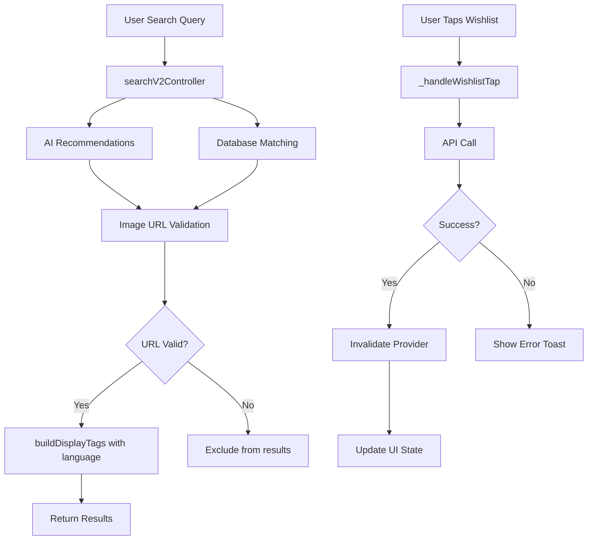

# Design Document: AI Search Bugfixes

## Overview

This design addresses three bugs in the AI search results feature:
1. Places with invalid/inaccessible images appearing in results
2. Wishlist UI not updating after save operations
3. Tags displaying in wrong language (German instead of user's preferred language)

The fixes involve modifications to the backend `searchV2Controller.ts` and the Flutter `ai_place_card.dart` widget.

## Architecture



## Components and Interfaces

### 1. Image URL Validator

A new utility function to validate image URLs before including places in results.

```typescript
interface ImageValidationResult {
  isValid: boolean;
  reason?: 'empty' | 'invalid_url' | 'http_error' | 'timeout';
}

async function validateImageUrl(url: string, timeoutMs: number = 5000): Promise<ImageValidationResult>
```

**Implementation Strategy:**
- Use HTTP HEAD request to check URL accessibility (faster than GET)
- Set timeout to 5 seconds to avoid blocking
- Cache validation results to avoid repeated checks for same URL
- For Wikipedia URLs, use specific validation logic

### 2. Language-Aware buildDisplayTags

Modify the existing `buildDisplayTags` function to accept a language parameter.

```typescript
function buildDisplayTags(
  categoryEn: string | null | undefined, 
  aiTags: any,
  language: 'en' | 'zh' = 'en'
): string[]
```

**Logic:**
1. Add category (use categoryEn for now, could add categoryZh later)
2. For each AI tag:
   - If string type: use as-is (legacy format)
   - If object type: use `tag[language]` field, fallback to `tag.en`, then `tag.id`
3. Deduplicate and limit to 3 tags

### 3. Wishlist State Management Fix

The current implementation already invalidates the provider, but the issue may be timing-related. Ensure proper sequencing:

```dart
// In _handleWishlistTap
await ref.read(tripRepositoryProvider).manageTripSpot(...);
ref.invalidate(tripsProvider);
ref.invalidate(wishlistStatusProvider);
// Force rebuild by reading the provider
await ref.read(wishlistStatusProvider.future);
widget.onWishlistChanged?.call(true);
```

## Data Models

### AITagElement (existing)
```typescript
interface AITagElement {
  kind: 'facet' | 'person' | 'architect';
  id: string;
  en: string;
  zh: string;
  priority?: number;
}
```

### PlaceResult (existing, no changes needed)
```typescript
interface PlaceResult {
  id: string;
  name: string;
  coverImage: string;
  tags: string[];
  // ... other fields
}
```

## Correctness Properties

*A property is a characteristic or behavior that should hold true across all valid executions of a system—essentially, a formal statement about what the system should do. Properties serve as the bridge between human-readable specifications and machine-verifiable correctness guarantees.*

### Property 1: Image URL Validation Excludes Invalid URLs

*For any* place with a coverImage URL, if the URL is empty, returns HTTP 404, or times out, the place SHALL be excluded from search results.

**Validates: Requirements 1.1, 1.2, 1.3, 1.4**

### Property 2: Language-Aware Tag Selection

*For any* AI tag object with `en` and `zh` fields, when `buildDisplayTags` is called with language parameter:
- If language='en', the output SHALL contain the `en` field value
- If language='zh', the output SHALL contain the `zh` field value
- If the requested language field is missing, the output SHALL fall back to `en`, then `id`
- If the tag is a string (legacy format), it SHALL be used as-is regardless of language

**Validates: Requirements 3.1, 3.2, 3.3, 3.5**

### Property 3: Wishlist State Consistency

*For any* successful wishlist save operation, the `wishlistStatusProvider` SHALL contain the saved place's ID mapped to its destination ID.

**Validates: Requirements 2.1, 2.2**

## Error Handling

### Image Validation Errors
- Network errors: Treat as invalid, exclude place
- Timeout: Treat as invalid, exclude place
- Invalid URL format: Treat as invalid, exclude place
- Log all exclusions for debugging

### Wishlist Errors
- API failure: Show error toast, revert UI state
- Network timeout: Show error toast, revert UI state
- Authentication required: Prompt login, don't change state

### Tag Processing Errors
- Missing language field: Fall back to `en`, then `id`
- Invalid tag format: Skip the tag, continue with others
- Empty tags array: Return empty array (valid state)

## Testing Strategy

### Unit Tests
- Test `validateImageUrl` with various URL types (empty, valid, 404, timeout)
- Test `buildDisplayTags` with different language parameters
- Test tag fallback logic when fields are missing

### Property-Based Tests
- **Property 1**: Generate random places with various image URL states, verify filtering
- **Property 2**: Generate random AI tag objects, verify correct language field selection
- **Property 3**: Simulate wishlist operations, verify state consistency

### Integration Tests
- End-to-end search with image validation
- Wishlist save and UI update flow

### Test Framework
- Backend: Jest with fast-check for property-based testing
- Frontend: Flutter test with mockito for API mocking
