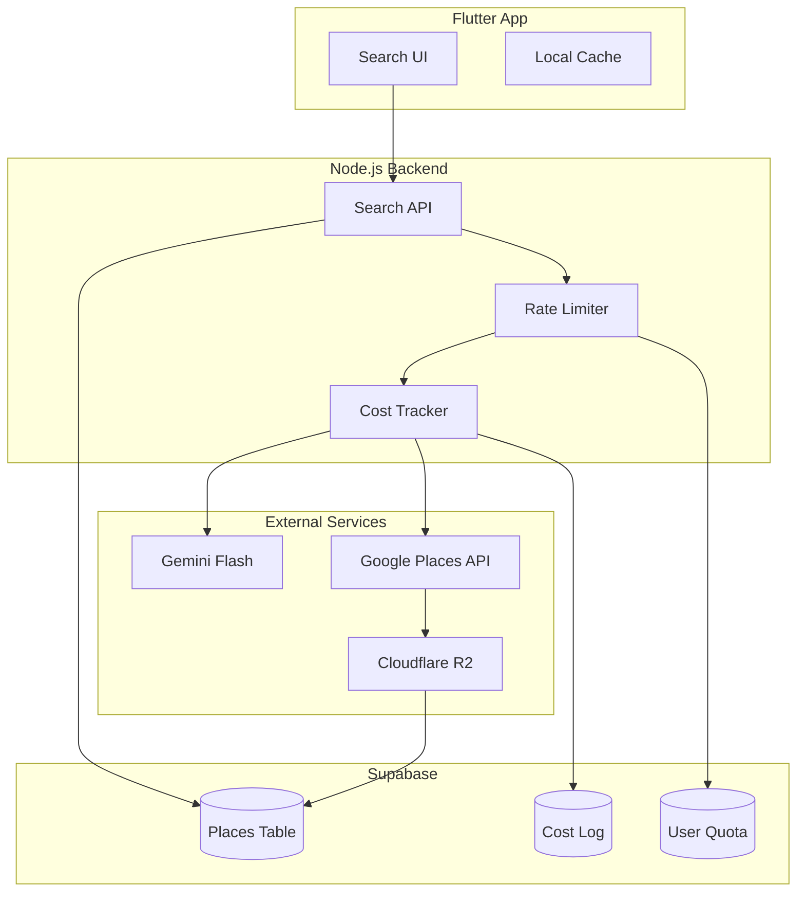

# Design Document: AI Search Cost Optimization

## Overview

本设计文档描述了 VAGO 应用 AI 搜索功能的成本优化方案。核心目标是将单次搜索成本从 $0.21 降低到 $0.035 或更低，通过以下三大策略实现：

1. **缓存优先 (Cache-First)**: 优先从 Supabase 数据库返回结果，避免重复调用 Google API
2. **打包搜索 (Batch Search)**: 使用 Google Places API (New) 的 Text Search 接口一次获取多个结果
3. **懒加载 (Lazy Loading)**: 列表页只显示基础信息，详情页才加载完整数据

## Architecture



## Components and Interfaces

### 1. SearchService (Backend)

负责协调搜索流程，实现缓存优先策略。

```typescript
interface SearchService {
  // 主搜索方法 - 缓存优先
  search(query: string, options: SearchOptions): Promise<SearchResult>;
  
  // 从缓存查询
  searchFromCache(intent: QueryIntent, limit: number): Promise<Place[]>;
  
  // 从 Google API 补充
  fetchFromGoogle(placeNames: string[], existingIds: Set<string>): Promise<Place[]>;
}

interface SearchOptions {
  userId: string;
  userTier: 'free' | 'plus';
  limit?: number;  // 默认 5，最大 5
  userLat?: number;
  userLng?: number;
}

interface SearchResult {
  places: Place[];
  fromCache: number;      // 缓存命中数量
  fromGoogle: number;     // Google API 获取数量
  estimatedCost: number;  // 预估成本 (USD)
  message: string;
}
```

### 2. GooglePlacesService (Backend)

封装 Google Places API 调用，实现打包搜索和字段控制。

```typescript
interface GooglePlacesService {
  // 打包文本搜索 - 使用 Text Search (New)
  textSearchBatch(query: string, fieldMask: string[]): Promise<PlaceBasic[]>;
  
  // 获取单个地点详情 - 仅在需要时调用
  getPlaceDetails(placeId: string, fieldMask: string[]): Promise<PlaceDetails>;
}

// 基础字段 - 列表页使用 (低成本)
const BASIC_FIELDS = [
  'places.id',
  'places.displayName',
  'places.formattedAddress',
  'places.location',
  'places.photos',  // 只获取 photo reference
];

// 高级字段 - 详情页使用 (高成本)
const ADVANCED_FIELDS = [
  'places.rating',
  'places.userRatingCount',
  'places.currentOpeningHours',
  'places.internationalPhoneNumber',
  'places.websiteUri',
  'places.priceLevel',
];
```

### 3. CostTracker (Backend)

追踪 API 调用成本，支持监控和限流。

```typescript
interface CostTracker {
  // 记录 API 调用
  logApiCall(call: ApiCallLog): Promise<void>;
  
  // 获取用户今日成本
  getUserDailyCost(userId: string): Promise<number>;
  
  // 获取用户今日搜索次数
  getUserDailySearchCount(userId: string): Promise<number>;
}

interface ApiCallLog {
  userId: string;
  endpoint: 'text_search' | 'place_details' | 'ai_intent' | 'ai_recommend';
  estimatedCost: number;
  timestamp: Date;
  placeCount?: number;
  fieldMask?: string[];
}

// 成本估算常量 (USD)
const COST_ESTIMATES = {
  TEXT_SEARCH_BASIC: 0.032,      // Text Search (New) - Basic
  TEXT_SEARCH_ADVANCED: 0.035,   // Text Search (New) - Advanced
  PLACE_DETAILS_BASIC: 0.00,     // Place Details - Basic (免费)
  PLACE_DETAILS_ADVANCED: 0.035, // Place Details - Advanced
  PLACE_DETAILS_PREFERRED: 0.04, // Place Details - Preferred
  AI_INTENT_PARSE: 0.001,        // Gemini Flash - 意图解析
  AI_RECOMMEND: 0.002,           // Gemini Flash - 推荐生成
};
```

### 4. RateLimiter (Backend)

实现用户级别的限流。

```typescript
interface RateLimiter {
  // 检查是否允许搜索
  canSearch(userId: string, userTier: 'free' | 'plus'): Promise<boolean>;
  
  // 记录搜索
  recordSearch(userId: string): Promise<void>;
}

const RATE_LIMITS = {
  free: 3,   // 免费用户每天 3 次
  plus: 50,  // Plus 用户每天 50 次
};
```

### 5. PlacesCacheService (Backend)

管理地点缓存的读写。

```typescript
interface PlacesCacheService {
  // 按条件查询缓存
  queryByIntent(intent: QueryIntent, limit: number): Promise<Place[]>;
  
  // 按 google_place_id 查询
  getByGooglePlaceId(placeId: string): Promise<Place | null>;
  
  // 批量检查存在性
  checkExistence(placeIds: string[]): Promise<Set<string>>;
  
  // 保存或更新地点 (upsert)
  upsertPlace(place: PlaceData): Promise<Place>;
  
  // 批量保存
  upsertPlaces(places: PlaceData[]): Promise<Place[]>;
}
```

## Data Models

### Place (Supabase Table)

```sql
CREATE TABLE places (
  id UUID PRIMARY KEY DEFAULT gen_random_uuid(),
  google_place_id VARCHAR(255) UNIQUE,
  name VARCHAR(255) NOT NULL,
  city VARCHAR(100),
  country VARCHAR(100),
  latitude DECIMAL(10, 8) NOT NULL,
  longitude DECIMAL(11, 8) NOT NULL,
  address TEXT,
  
  -- 基础字段 (列表页)
  cover_image TEXT,           -- R2 URL
  images JSONB DEFAULT '[]',  -- R2 URLs array
  
  -- 高级字段 (详情页，可能为空)
  rating DECIMAL(2, 1),
  rating_count INTEGER,
  opening_hours JSONB,
  phone_number VARCHAR(50),
  website TEXT,
  price_level INTEGER,
  
  -- AI 生成字段
  category VARCHAR(50),
  ai_tags JSONB DEFAULT '[]',
  ai_summary TEXT,
  description TEXT,
  
  -- 元数据
  source VARCHAR(50) DEFAULT 'google_maps',
  last_synced_at TIMESTAMP WITH TIME ZONE,
  created_at TIMESTAMP WITH TIME ZONE DEFAULT NOW(),
  updated_at TIMESTAMP WITH TIME ZONE DEFAULT NOW()
);

CREATE INDEX idx_places_city ON places(city);
CREATE INDEX idx_places_google_place_id ON places(google_place_id);
CREATE INDEX idx_places_category ON places(category);
```

### ApiCostLog (Supabase Table)

```sql
CREATE TABLE api_cost_logs (
  id UUID PRIMARY KEY DEFAULT gen_random_uuid(),
  user_id UUID NOT NULL,
  endpoint VARCHAR(50) NOT NULL,
  estimated_cost DECIMAL(10, 6) NOT NULL,
  place_count INTEGER,
  field_mask JSONB,
  created_at TIMESTAMP WITH TIME ZONE DEFAULT NOW()
);

CREATE INDEX idx_cost_logs_user_date ON api_cost_logs(user_id, created_at);
```

### UserSearchQuota (Supabase Table)

```sql
CREATE TABLE user_search_quotas (
  id UUID PRIMARY KEY DEFAULT gen_random_uuid(),
  user_id UUID NOT NULL,
  search_date DATE NOT NULL,
  search_count INTEGER DEFAULT 0,
  total_cost DECIMAL(10, 6) DEFAULT 0,
  UNIQUE(user_id, search_date)
);

CREATE INDEX idx_quota_user_date ON user_search_quotas(user_id, search_date);
```

## Correctness Properties

*A property is a characteristic or behavior that should hold true across all valid executions of a system—essentially, a formal statement about what the system should do. Properties serve as the bridge between human-readable specifications and machine-verifiable correctness guarantees.*

### Property 1: Cache-First Query Order

*For any* search request, the system SHALL query the Places_Cache before making any Google API calls. If the cache contains sufficient results (≥ requested count), no Google API calls SHALL be made.

**Validates: Requirements 1.1, 1.2**

### Property 2: Batch Search Efficiency

*For any* search that requires fetching N places from Google (where N ≤ 5), the system SHALL make at most 1 Text Search API call, regardless of N.

**Validates: Requirements 2.1, 2.3**

### Property 3: Cache Deduplication by google_place_id

*For any* place saved to the cache, if a place with the same google_place_id already exists, the system SHALL update the existing record instead of creating a duplicate. The cache SHALL never contain two places with the same google_place_id.

**Validates: Requirements 4.2, 4.3**

### Property 4: AI Recommendation Limit

*For any* search query, the number of AI-generated place recommendations SHALL never exceed 5, regardless of user request.

**Validates: Requirements 5.1, 5.2**

### Property 5: R2 Image URL Storage

*For any* place saved to the cache with images, the stored image URLs SHALL point to Cloudflare R2 (not Google photo references), unless R2 upload failed.

**Validates: Requirements 6.1, 6.3**

### Property 6: Result Deduplication

*For any* search result set, there SHALL be no duplicate places (by google_place_id). Each place SHALL appear at most once.

**Validates: Requirements 7.3**

### Property 7: Rate Limit Enforcement

*For any* user, when their daily search count exceeds their tier limit (3 for free, 50 for plus), subsequent search requests SHALL return a rate limit error.

**Validates: Requirements 8.3, 8.4**

### Property 8: Cost Logging Completeness

*For any* Google API call made by the system, a corresponding cost log entry SHALL be created with timestamp, endpoint, and estimated cost.

**Validates: Requirements 8.1**

## Error Handling

### Google API Errors

| Error | Handling |
|-------|----------|
| OVER_QUERY_LIMIT | Return cached results only, log warning |
| INVALID_REQUEST | Return error to user, log for debugging |
| REQUEST_DENIED | Check API key, return error to user |
| ZERO_RESULTS | Return empty result, no error |

### R2 Upload Errors

| Error | Handling |
|-------|----------|
| Upload timeout | Store Google photo reference as fallback |
| Storage quota exceeded | Log alert, use Google photo reference |
| Network error | Retry once, then fallback |

### Rate Limit Errors

```typescript
interface RateLimitError {
  code: 'RATE_LIMIT_EXCEEDED';
  message: string;
  dailyLimit: number;
  currentCount: number;
  resetTime: Date;  // 次日 00:00 UTC
}
```

## Testing Strategy

### Unit Tests

- SearchService: 测试缓存优先逻辑、结果合并、去重
- GooglePlacesService: 测试 Field Mask 设置、API 调用参数
- CostTracker: 测试成本计算、日志记录
- RateLimiter: 测试限流逻辑、计数器

### Property-Based Tests

使用 fast-check (TypeScript) 进行属性测试：

1. **Cache-First Property**: 生成随机搜索请求，验证缓存命中时不调用 Google API
2. **Deduplication Property**: 生成随机地点列表，验证结果无重复
3. **Rate Limit Property**: 生成随机用户请求序列，验证限流正确触发
4. **Cost Logging Property**: 生成随机 API 调用，验证日志完整性

### Integration Tests

- 端到端搜索流程测试
- 缓存写入和读取一致性测试
- R2 图片上传和 URL 存储测试

### Cost Monitoring Tests

- 验证单次搜索成本不超过 $0.05
- 验证缓存命中时成本为 $0
