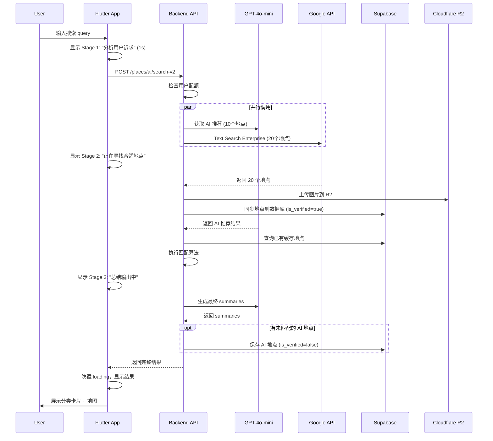

# Design Document: AI Search V2 - Parallel Pipeline

## Overview

本设计文档描述了 VAGO 应用 AI 搜索功能 V2 版本的技术实现方案。核心架构是 GPT-4o-mini（通过 Kouri 代理）与 Google Maps Text Search Enterprise 的并行调用，通过智能数据匹配实现高质量、低成本的地点推荐。

### 成本估算

| 组件 | 单次成本 | 说明 |
|------|---------|------|
| GPT-4o-mini (Kouri) | ~$0.002 | 意图解析 + 10个地点推荐 |
| Google Text Search | $0.035 | 20个地点基础信息 |
| Google Photo (1张) | $0.007 | 只取第一张照片 |
| GPT-4o-mini Summary | ~$0.001 | 最终 summary 生成 |
| **总计** | **~$0.045** | 每次搜索 |

## Architecture

```mermaid
flowchart TD
    subgraph Client["Flutter App"]
        UI[AI Assistant Page]
        LoadingState[Loading State Manager]
        ResultView[Result View]
    end
    
    subgraph Backend["Node.js Backend"]
        SearchAPI[/places/ai/search-v2]
        AIService[AI Service]
        GoogleService[Google Places Service]
        Matcher[Place Matcher]
        SummaryGen[Summary Generator]
    end
    
    subgraph Providers["AI Providers"]
        Kouri[Kouri Provider]
        Azure[Azure OpenAI]
        Gemini[Gemini]
    end
    
    subgraph External["External APIs"]
        GPT[GPT-4o-mini]
        GoogleAPI[Google Text Search Enterprise]
        R2[Cloudflare R2]
    end
    
    subgraph Database["Supabase"]
        Places[(places)]
        Quota[(user_search_quotas)]
    end
    
    UI --> SearchAPI
    SearchAPI --> AIService
    SearchAPI --> GoogleService
    
    AIService --> Kouri
    Kouri --> GPT
    AIService -.-> Azure
    AIService -.-> Gemini
    
    GoogleService --> GoogleAPI
    GoogleService --> R2
    GoogleService --> Places
    
    Matcher --> Places
    SummaryGen --> AIService
    
    SearchAPI --> Matcher
    Matcher --> SummaryGen
    SummaryGen --> UI
```

## Components and Interfaces

### 1. SearchV2Controller (Backend)

新的搜索 API 端点，协调并行调用和数据匹配。

```typescript
interface SearchV2Request {
  query: string;
  userId: string;
  userLat?: number;
  userLng?: number;
}

interface SearchV2Response {
  success: boolean;
  acknowledgment: string;           // AI 承接文案
  categories?: CategoryGroup[];     // 分类结果（可选，由 AI 决定）
  places: PlaceResult[];            // 无分类时的平铺结果（最多 5 个）
  overallSummary: string;           // 总结 summary
  quotaRemaining: number;           // 剩余搜索次数
  stage: 'analyzing' | 'searching' | 'summarizing' | 'complete';
}

interface CategoryGroup {
  title: string;                    // 分类标题
  places: PlaceResult[];            // 该分类下的地点（2-5 个）
}

interface PlaceResult {
  id?: string;                      // Supabase ID (如果已存在)
  googlePlaceId?: string;           // Google Place ID (如果匹配到)
  name: string;
  summary: string;                  // AI 生成的 summary
  coverImage: string;               // R2 URL 或 AI 提供的 URL
  latitude: number;
  longitude: number;
  city?: string;
  country?: string;
  rating?: number;                  // Google 评分 (AI-only 时为空)
  ratingCount?: number;             // Google 评分人数 (AI-only 时为空)
  recommendationPhrase?: string;    // AI 推荐短语 (AI-only 时显示)
  tags?: string[];                  // AI 标签
  isVerified: boolean;              // 是否有 Google 验证
  source: 'google' | 'cache' | 'ai';
}
```

### 2. AIRecommendationService (Backend)

封装 GPT-4o-mini 调用，生成地点推荐。

```typescript
interface AIRecommendationService {
  // 并行调用第一步：获取 AI 推荐
  getRecommendations(query: string): Promise<AIRecommendationResult>;
  
  // 最终 summary 生成
  generateSummaries(places: PlaceBasicInfo[]): Promise<SummaryResult>;
}

interface AIRecommendationResult {
  acknowledgment: string;           // 承接文案
  categories?: AICategory[];        // 分类（可选）
  places: AIPlace[];                // 10个推荐地点
}

interface AICategory {
  title: string;
  placeNames: string[];             // 该分类下的地点名称
}

interface AIPlace {
  name: string;
  summary: string;
  latitude: number;
  longitude: number;
  city: string;
  country: string;
  coverImageUrl: string;
  tags: string[];
  recommendationPhrase: string;
}

interface SummaryResult {
  placeSummaries: Map<string, string>;  // 地点名 -> summary
  overallSummary: string;
}
```

### 3. GooglePlacesEnterpriseService (Backend)

封装 Google Text Search Enterprise API 调用。

```typescript
interface GooglePlacesEnterpriseService {
  // 批量文本搜索 - 返回 20 个地点
  textSearchEnterprise(query: string): Promise<GooglePlace[]>;
  
  // 同步地点到数据库
  syncPlacesToDatabase(places: GooglePlace[]): Promise<void>;
  
  // 上传图片到 R2
  uploadPhotoToR2(photoReference: string, placeId: string): Promise<string>;
}

interface GooglePlace {
  placeId: string;
  displayName: string;
  location: { lat: number; lng: number };
  types: string[];
  addressComponents: AddressComponent[];
  formattedAddress: string;
  photoReference?: string;
  openingHours?: OpeningHours;
  rating?: number;
  userRatingCount?: number;
  phoneNumber?: string;
  websiteUri?: string;
  googleMapsUri: string;
  priceLevel?: number;
  priceRange?: string;
}

// Field Mask 配置 - 控制成本
const ENTERPRISE_FIELD_MASK = [
  'places.id',
  'places.displayName',
  'places.location',
  'places.types',
  'places.addressComponents',
  'places.formattedAddress',
  'places.photos',
  'places.currentOpeningHours',
  'places.rating',
  'places.userRatingCount',
  'places.internationalPhoneNumber',
  'places.websiteUri',
  'places.googleMapsUri',
  'places.priceLevel',
  'places.priceRange',
];
```

### 4. PlaceMatcherService (Backend)

负责将 AI 推荐与数据库/Google 结果匹配。

```typescript
interface PlaceMatcherService {
  // 匹配 AI 推荐与已有数据
  matchPlaces(
    aiPlaces: AIPlace[],
    googlePlaces: GooglePlace[],
    cachedPlaces: CachedPlace[]
  ): Promise<MatchResult>;
}

interface MatchResult {
  matched: MatchedPlace[];          // 成功匹配的地点
  unmatched: AIPlace[];             // 未匹配的 AI 地点
  needsSupplement: boolean;         // 是否需要用 AI 内容补充
}

interface MatchedPlace {
  aiPlace: AIPlace;
  source: 'google' | 'cache';
  googlePlaceId?: string;
  cachedId?: string;
  matchScore: number;               // 匹配分数 (0-1)
}

// 匹配算法配置
const MATCH_CONFIG = {
  nameSimThreshold: 0.7,            // 名称相似度阈值
  maxDistanceMeters: 500,           // 最大距离阈值
  minMatchesPerCategory: 2,         // 每个分类最少匹配数
  maxMatchesPerCategory: 5,         // 每个分类最多展示数
  minTotalMatches: 5,               // 无分类时最少匹配数
  maxTotalMatches: 5,               // 无分类时最多展示数
};
```

### 5. QuotaService (Backend)

管理用户搜索配额。

```typescript
interface QuotaService {
  // 检查用户是否可以搜索
  canSearch(userId: string): Promise<boolean>;
  
  // 消耗一次搜索配额
  consumeQuota(userId: string): Promise<void>;
  
  // 获取剩余配额
  getRemainingQuota(userId: string): Promise<number>;
}

const DAILY_QUOTA = 10;  // 每天 10 次
```

## Data Models

### Place (Supabase Table) - 更新

```sql
-- 添加 is_verified 字段
ALTER TABLE places ADD COLUMN IF NOT EXISTS is_verified BOOLEAN DEFAULT false;

-- 迁移：将所有有 google_place_id 的地点设为 verified
UPDATE places SET is_verified = true WHERE google_place_id IS NOT NULL;

-- 创建索引
CREATE INDEX IF NOT EXISTS idx_places_is_verified ON places(is_verified);
```

### AI Place 字段映射

| GPT-4o-mini 输出 | Supabase 字段 | 说明 |
|-----------------|---------------|------|
| name | name | 地点名称 |
| summary | ai_description | AI 生成的介绍 |
| tags | ai_tags | AI 生成的标签 |
| cover_image_url | cover_image | 封面图 URL |
| latitude | latitude | 纬度 |
| longitude | longitude | 经度 |
| city | city | 城市 |
| country | country | 国家 |
| - | is_verified | false (AI 生成) |
| - | source | 'ai_search' |

## Sequence Diagram




## GPT-4o-mini Prompt Design

### 第一步：地点推荐 Prompt

```typescript
const RECOMMENDATION_SYSTEM_PROMPT = `You are a travel expert helping users discover places.
Your task is to understand the user's intent and recommend 10 specific places.

Output format (JSON):
{
  "acknowledgment": "A friendly message acknowledging the user's request and explaining your approach",
  "categories": [  // Optional, include only if the query naturally fits into categories
    {
      "title": "Category name (e.g., 精品咖啡, 小众博物馆)",
      "placeNames": ["Place 1", "Place 2"]  // At least 2 places per category
    }
  ],
  "places": [
    {
      "name": "Exact place name",
      "summary": "1-2 sentence description (max 100 chars)",
      "latitude": 0.0,
      "longitude": 0.0,
      "city": "City name",
      "country": "Country name",
      "coverImageUrl": "A publicly accessible image URL for this place",
      "tags": ["tag1", "tag2", "tag3"],  // 2-3 style tags
      "recommendationPhrase": "e.g., highly rated, local favorite, hidden gem"
    }
  ]
}

Rules:
1. Always return exactly 10 places
2. If using categories, ensure each category has at least 2 places
3. Use the same language as the user's query for acknowledgment and category titles
4. Provide real, existing places with accurate coordinates
5. coverImageUrl should be a real, publicly accessible image URL
6. tags should describe the place's style/vibe
7. recommendationPhrase should be a short, catchy phrase`;

const RECOMMENDATION_USER_PROMPT = (query: string) => 
  `User query: ${query}\n\nProvide 10 place recommendations.`;
```

### 第二步：Summary 生成 Prompt

```typescript
const SUMMARY_SYSTEM_PROMPT = `You are a travel writer creating engaging summaries.
Generate a brief summary for each place and an overall summary for the recommendation.

Output format (JSON):
{
  "placeSummaries": {
    "Place Name 1": "1-2 sentence summary",
    "Place Name 2": "1-2 sentence summary"
  },
  "overallSummary": "A friendly closing message summarizing the recommendations and wishing the user a great trip"
}

Rules:
1. Keep each place summary under 100 characters
2. The overall summary should be warm and encouraging
3. Use the same language as the original query`;

const SUMMARY_USER_PROMPT = (places: PlaceBasicInfo[], originalQuery: string) => 
  `Original query: ${originalQuery}
  
Places to summarize:
${places.map(p => `- ${p.name} (${p.city}, ${p.country})`).join('\n')}

Generate summaries for these places.`;
```

## Matching Algorithm

```typescript
function matchPlaces(
  aiPlaces: AIPlace[],
  googlePlaces: GooglePlace[],
  cachedPlaces: CachedPlace[]
): MatchResult {
  const matched: MatchedPlace[] = [];
  const unmatched: AIPlace[] = [];
  
  // 合并 Google 和缓存地点
  const allVerifiedPlaces = [
    ...googlePlaces.map(p => ({ ...p, source: 'google' as const })),
    ...cachedPlaces.map(p => ({ ...p, source: 'cache' as const })),
  ];
  
  for (const aiPlace of aiPlaces) {
    let bestMatch: { place: any; score: number; source: 'google' | 'cache' } | null = null;
    
    for (const verifiedPlace of allVerifiedPlaces) {
      // 计算名称相似度 (Levenshtein distance normalized)
      const nameSim = calculateNameSimilarity(aiPlace.name, verifiedPlace.displayName || verifiedPlace.name);
      
      // 计算地理距离
      const distance = calculateDistance(
        aiPlace.latitude, aiPlace.longitude,
        verifiedPlace.location?.lat || verifiedPlace.latitude,
        verifiedPlace.location?.lng || verifiedPlace.longitude
      );
      
      // 综合评分
      const distanceScore = distance <= MATCH_CONFIG.maxDistanceMeters ? 1 : 0;
      const score = nameSim * 0.7 + distanceScore * 0.3;
      
      if (score >= MATCH_CONFIG.nameSimThreshold && (!bestMatch || score > bestMatch.score)) {
        bestMatch = { place: verifiedPlace, score, source: verifiedPlace.source };
      }
    }
    
    if (bestMatch) {
      matched.push({
        aiPlace,
        source: bestMatch.source,
        googlePlaceId: bestMatch.place.placeId || bestMatch.place.google_place_id,
        cachedId: bestMatch.place.id,
        matchScore: bestMatch.score,
      });
    } else {
      unmatched.push(aiPlace);
    }
  }
  
  // 判断是否需要补充
  const needsSupplement = checkNeedsSupplement(matched, aiPlaces);
  
  return { matched, unmatched, needsSupplement };
}

function checkNeedsSupplement(matched: MatchedPlace[], aiPlaces: AIPlace[]): boolean {
  // 检查是否有分类
  const hasCategories = aiPlaces.some(p => p.category);
  
  if (hasCategories) {
    // 有分类：检查每个分类是否有 2+ 匹配
    const categoryMatches = new Map<string, number>();
    for (const m of matched) {
      const cat = m.aiPlace.category;
      if (cat) {
        categoryMatches.set(cat, (categoryMatches.get(cat) || 0) + 1);
      }
    }
    return Array.from(categoryMatches.values()).some(count => count < MATCH_CONFIG.minMatchesPerCategory);
  } else {
    // 无分类：检查总匹配数是否 >= 5
    return matched.length < MATCH_CONFIG.minTotalMatches;
  }
}
```

## Flutter UI Components

### Loading State Manager

```dart
enum SearchStage {
  analyzing,    // Stage 1: 分析用户诉求 (1s)
  searching,    // Stage 2: 正在寻找合适地点
  summarizing,  // Stage 3: 总结输出中
  complete,     // 完成
}

class SearchLoadingState {
  final SearchStage stage;
  final String message;
  
  const SearchLoadingState.analyzing() 
    : stage = SearchStage.analyzing, 
      message = '分析用户诉求...';
  
  const SearchLoadingState.searching() 
    : stage = SearchStage.searching, 
      message = '正在寻找合适地点...';
  
  const SearchLoadingState.summarizing() 
    : stage = SearchStage.summarizing, 
      message = '总结输出中...';
  
  const SearchLoadingState.complete() 
    : stage = SearchStage.complete, 
      message = '';
}
```

### Result Display Components

```dart
// 分类展示 - 横滑 4:3 卡片
class CategorySection extends StatelessWidget {
  final String title;
  final List<PlaceResult> places;
  
  @override
  Widget build(BuildContext context) {
    return Column(
      crossAxisAlignment: CrossAxisAlignment.start,
      children: [
        Text(title, style: AppTheme.headlineSmall),
        SizedBox(height: 12),
        SizedBox(
          height: 200,  // 4:3 aspect ratio card height
          child: ListView.separated(
            scrollDirection: Axis.horizontal,
            itemCount: places.length,
            separatorBuilder: (_, __) => SizedBox(width: 12),
            itemBuilder: (context, index) => PlaceCard43(place: places[index]),
          ),
        ),
      ],
    );
  }
}

// 无分类展示 - 平铺横向卡片
class FlatPlaceList extends StatelessWidget {
  final List<PlaceResult> places;
  
  @override
  Widget build(BuildContext context) {
    return Column(
      children: places.map((place) => PlaceCardHorizontal(place: place)).toList(),
    );
  }
}

// AI 地点卡片 - 显示 recommendation phrase 而非评分
class AIPlaceCard extends StatelessWidget {
  final PlaceResult place;
  
  @override
  Widget build(BuildContext context) {
    return Container(
      // ... card styling
      child: Column(
        children: [
          Image.network(place.coverImage),
          Text(place.name),
          // 显示 recommendation phrase 而非评分
          Text(place.recommendationPhrase ?? 'AI Recommended'),
          Text(place.summary),
        ],
      ),
    );
  }
}
```

## Error Handling

| 错误场景 | 处理方式 |
|---------|---------|
| GPT-4o-mini 超时 | 使用 Google 结果 + 默认 summary |
| Google API 超时 | 使用 AI 结果 + 数据库缓存 |
| 两者都失败 | 返回错误，提示用户重试 |
| 配额用完 | 返回友好提示，显示重置时间 |
| 匹配数不足 | 用 AI 内容补充，标记 is_verified=false |

## Testing Strategy

### Unit Tests

- AIRecommendationService: 测试 prompt 构建、JSON 解析
- PlaceMatcherService: 测试匹配算法、阈值边界
- QuotaService: 测试配额检查、消耗、重置

### Property-Based Tests

使用 fast-check (TypeScript) 进行属性测试：

1. **Parallel Execution Property**: 验证并行调用不会相互阻塞
2. **Matching Consistency Property**: 相同输入产生相同匹配结果
3. **Quota Enforcement Property**: 配额用完后拒绝搜索

### Integration Tests

- 端到端搜索流程测试
- 并行调用超时处理测试
- 数据库同步一致性测试


## Correctness Properties

*A property is a characteristic or behavior that should hold true across all valid executions of a system—essentially, a formal statement about what the system should do. Properties serve as the bridge between human-readable specifications and machine-verifiable correctness guarantees.*

### Property 1: Parallel Execution Independence

*For any* search request, the GPT-4o-mini call and Google Text Search call SHALL execute in parallel, meaning neither call blocks the other from starting. The total execution time SHALL be approximately max(AI_time, Google_time), not AI_time + Google_time.

**Validates: Requirements 2.1, 2.4**

### Property 2: AI Recommendation Count Invariant

*For any* valid GPT-4o-mini response, the number of place recommendations SHALL be exactly 10. If the response contains fewer or more than 10 places, it SHALL be considered invalid and trigger a retry or fallback.

**Validates: Requirements 3.3**

### Property 3: Category Minimum Places

*For any* GPT-4o-mini response that includes categories (categories are optional, decided by AI), each category SHALL contain at least 2 places. The display limit per category is 2-5 places.

**Validates: Requirements 3.4, 9.2**

### Property 4: Place Schema Completeness

*For any* place in the GPT-4o-mini response, it SHALL contain all required fields: name, summary, latitude, longitude, city, country, coverImageUrl, tags, recommendationPhrase. Missing any required field SHALL make the place invalid.

**Validates: Requirements 3.5**

### Property 5: Summary Length Constraint

*For any* place summary generated by GPT-4o-mini, the character count SHALL NOT exceed 100 characters.

**Validates: Requirements 3.6**

### Property 6: Google Places Sync Consistency

*For any* place fetched from Google Text Search Enterprise, after the sync operation completes, the place SHALL exist in the Supabase database with is_verified = true and a valid google_place_id.

**Validates: Requirements 4.5, 14.5**

### Property 7: Display Count Limits

*For any* final search result displayed to users:
- IF categories exist, EACH category SHALL show 2-5 places
- IF no categories exist, the total displayed places SHALL be at most 5
- The internal AI recommendation (10) and Google fetch (20) counts are for matching purposes only

**Validates: Requirements 9.2, 9.4**

### Property 8: is_verified Consistency

*For any* place in the database:
- IF google_place_id IS NOT NULL, THEN is_verified SHALL be true
- IF google_place_id IS NULL AND source = 'ai_search', THEN is_verified SHALL be false

**Validates: Requirements 14.1, 14.5**

### Property 9: Daily Quota Enforcement

*For any* user, after making 10 successful searches in a day, subsequent search requests SHALL be rejected with a quota exceeded error until the next day (00:00 UTC).

**Validates: Requirements 13.1**

### Property 10: Fallback on Partial Failure

*For any* search request where exactly one of GPT-4o-mini or Google Text Search fails:
- IF GPT-4o-mini fails, the system SHALL return Google results with default summaries
- IF Google fails, the system SHALL return AI results matched against cached database

**Validates: Requirements 2.5**
