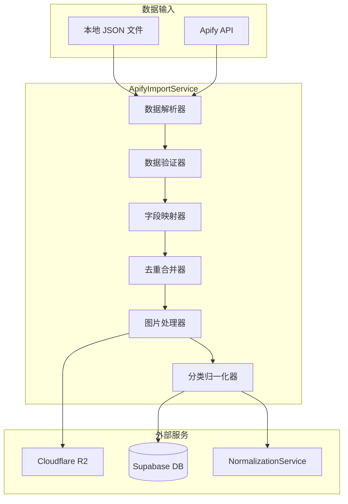

# Design Document: Apify Data Import

## Overview

本设计文档描述如何将 Apify 爬取的 Google Places 数据导入到 Supabase 数据库。系统将实现字段映射、数据去重与合并、图片存储到 R2、以及分类标签归一化等功能。

## Architecture



## Components and Interfaces

### 1. ApifyImportService

主服务类，协调整个导入流程。

```typescript
interface ApifyImportService {
  // 从本地 JSON 文件导入
  importFromFile(filePath: string, options?: ImportOptions): Promise<ImportResult>;
  
  // 从 Apify Dataset 导入
  importFromDataset(datasetId: string, options?: ImportOptions): Promise<ImportResult>;
  
  // 导入单条数据（内部使用）
  importSinglePlace(item: ApifyPlaceItem): Promise<PlaceImportResult>;
}

interface ImportOptions {
  batchSize?: number;        // 批量大小，默认 100
  dryRun?: boolean;          // 只验证不写入
  skipImages?: boolean;      // 跳过图片处理
  delayMs?: number;          // 批次间延迟，默认 100ms
}

interface ImportResult {
  total: number;
  inserted: number;
  updated: number;
  skipped: number;
  failed: number;
  errors: Array<{ placeId?: string; error: string }>;
  stats: ImportStats;
}

interface ImportStats {
  cityCount: number;
  categoryDistribution: Record<string, number>;
  coverImageRate: number;      // 封面图覆盖率
  openingHoursRate: number;    // 营业时间覆盖率
  requiredFieldsRate: number;  // 必填字段覆盖率
}
```

### 2. ApifyFieldMapper

负责将 Apify 数据字段映射到 Place 表结构。

```typescript
interface ApifyFieldMapper {
  // 映射单条 Apify 数据到 Place 结构
  mapToPlace(item: ApifyPlaceItem): MappedPlace;
  
  // 提取 sourceDetails
  extractSourceDetails(item: ApifyPlaceItem): SourceDetails;
  
  // 提取 customFields
  extractCustomFields(item: ApifyPlaceItem): CustomFields;
}

interface MappedPlace {
  name: string;
  latitude: number;
  longitude: number;
  address?: string;
  city?: string;
  country?: string;
  rating?: number;
  ratingCount?: number;
  googlePlaceId?: string;
  website?: string;
  phoneNumber?: string;
  openingHours?: string;  // JSON string
  description?: string;
  source: 'apify_google_places';
  sourceDetails: SourceDetails;
  customFields: CustomFields;
}

interface SourceDetails {
  apify: {
    scrapedAt: string;
    searchString?: string;
    rank?: number;
    fid?: string;
    cid?: string;
    kgmid?: string;
    searchHits: Array<{
      searchString: string;
      rank: number;
      scrapedAt: string;
      searchPageUrl?: string;
    }>;
  };
}

interface CustomFields {
  priceText?: string;
  r2Key?: string;
  imageSourceUrl?: string;
  imageMigratedAt?: string;
  additionalInfo?: Record<string, any>;
  reviewsTags?: Array<{ title: string; count: number }>;
  popularTimes?: Record<string, any>;
  reviewsDistribution?: Record<string, number>;
  categoriesRaw?: string[];
  googleIds?: { fid?: string; cid?: string };
}
```

### 3. PlaceMergeService

负责处理数据去重和合并逻辑。

```typescript
interface PlaceMergeService {
  // 查找现有记录
  findExisting(item: ApifyPlaceItem): Promise<Place | null>;
  
  // 合并新旧数据
  merge(existing: Place, incoming: MappedPlace): MergedPlace;
  
  // 执行 upsert
  upsert(place: MergedPlace): Promise<Place>;
}

interface MergeStrategy {
  // 非空覆盖字段
  nonNullOverwrite: string[];
  // 取较大值字段
  takeGreater: string[];
  // 取较新值字段（基于 scrapedAt）
  takeNewer: string[];
  // 追加数组字段
  appendArray: string[];
}

const DEFAULT_MERGE_STRATEGY: MergeStrategy = {
  nonNullOverwrite: ['name', 'address', 'website', 'phoneNumber', 'description'],
  takeGreater: ['ratingCount'],
  takeNewer: ['openingHours', 'rating'],
  appendArray: ['sourceDetails.apify.searchHits'],
};
```

### 4. R2ImageService

负责图片下载、处理和上传到 R2。

```typescript
interface R2ImageService {
  // 处理并上传图片
  processAndUpload(imageUrl: string): Promise<ImageUploadResult>;
  
  // 生成 R2 key
  generateR2Key(): string;
  
  // 构建公开 URL
  buildPublicUrl(r2Key: string): string;
}

interface ImageUploadResult {
  success: boolean;
  r2Key?: string;
  publicUrl?: string;
  error?: string;
}

// R2 Key 格式: places/cover/v1/{uuid_prefix2}/{uuid_prefix4}/{uuid}.jpg
// 示例: places/cover/v1/a3/f9/a3f9c2d9-5e0e-4a8d-9c2f-2bdb2c9f0a11.jpg
```

### 5. ApifyDataValidator

负责验证数据完整性。

```typescript
interface ApifyDataValidator {
  // 验证必填字段
  validateRequired(item: ApifyPlaceItem): ValidationResult;
  
  // 验证数据格式
  validateFormat(item: ApifyPlaceItem): ValidationResult;
}

interface ValidationResult {
  valid: boolean;
  errors: string[];
  warnings: string[];
}

// 必填字段
const REQUIRED_FIELDS = ['placeId', 'city', 'countryCode', 'location.lat', 'location.lng'];
```

## Data Models

### Apify Place Item (输入)

```typescript
interface ApifyPlaceItem {
  title: string;
  subTitle?: string;
  price?: string;                    // "€1–10"
  categoryName?: string;             // "Coffee shop"
  address?: string;
  neighborhood?: string;
  street?: string;
  city?: string;
  postalCode?: string;
  state?: string;
  countryCode?: string;              // "FR"
  website?: string;
  phone?: string;
  phoneUnformatted?: string;
  location: {
    lat: number;
    lng: number;
  };
  totalScore?: number;               // 4.5
  permanentlyClosed?: boolean;
  temporarilyClosed?: boolean;
  placeId: string;                   // "ChIJZ7SPu5xv5kcRGMfYOG3bVhs"
  categories?: string[];             // ["Coffee shop"]
  fid?: string;                      // "0x47e66f9cbb8fb467:0x1b56db6d38d8c718"
  cid?: string;                      // "1970003149172819736"
  reviewsCount?: number;
  imagesCount?: number;
  imageCategories?: string[];
  scrapedAt?: string;                // ISO timestamp
  openingHours?: Array<{
    day: string;
    hours: string;
  }>;
  reviewsTags?: Array<{
    title: string;
    count: number;
  }>;
  additionalInfo?: Record<string, any>;
  popularTimesHistogram?: Record<string, any>;
  reviewsDistribution?: {
    oneStar: number;
    twoStar: number;
    threeStar: number;
    fourStar: number;
    fiveStar: number;
  };
  url?: string;
  searchPageUrl?: string;
  searchString?: string;
  language?: string;
  rank?: number;
  imageUrl?: string;
  kgmid?: string;
  description?: string;
  plusCode?: string;
}
```

### Place (输出 - Supabase)

参考现有 Prisma schema 中的 Place 模型，主要字段：

- `id`: UUID
- `name`: string
- `latitude`, `longitude`: float
- `address`, `city`, `country`: string
- `rating`, `ratingCount`: number
- `googlePlaceId`: string (unique)
- `categorySlug`, `categoryEn`, `categoryZh`: string
- `tags`: jsonb (StructuredTags)
- `aiTags`: jsonb[]
- `coverImage`: string (R2 URL)
- `openingHours`: string (JSON)
- `source`: string
- `sourceDetails`: jsonb
- `customFields`: jsonb

## Correctness Properties

*A property is a characteristic or behavior that should hold true across all valid executions of a system—essentially, a formal statement about what the system should do. Properties serve as the bridge between human-readable specifications and machine-verifiable correctness guarantees.*

### Property 1: Field Mapping Correctness

*For any* valid Apify place item, mapping to Place should preserve all non-null source values in their corresponding target fields (title→name, location.lat→latitude, location.lng→longitude, etc.)

**Validates: Requirements 1.1, 1.2, 1.3, 1.4, 1.5, 1.6, 1.7, 1.8, 1.9, 1.10, 1.11, 1.12, 1.13**

### Property 2: Deduplication by PlaceId

*For any* set of Apify items containing duplicates (same placeId), importing them should result in exactly one Place record per unique placeId

**Validates: Requirements 2.1, 2.2**

### Property 3: Merge Strategy - Non-Null Overwrite

*For any* conflict where existing record has a non-null value and incoming has null, the existing value should be preserved; if incoming is non-null, it should overwrite

**Validates: Requirements 2.3**

### Property 4: Merge Strategy - Take Greater

*For any* conflict on ratingCount, the merged result should have the greater value; rating should come from the side with greater ratingCount

**Validates: Requirements 2.4**

### Property 5: Merge Strategy - Take Newer

*For any* conflict on openingHours, the merged result should have the value from the record with more recent scrapedAt

**Validates: Requirements 2.5**

### Property 6: SearchHits Append

*For any* conflict, sourceDetails.apify.searchHits should be the union of existing and incoming hits (no duplicates, no overwrites)

**Validates: Requirements 2.6**

### Property 7: Required Fields Validation

*For any* Apify item missing required fields (placeId, city, countryCode, latitude, longitude), the import should skip it and not create a Place record

**Validates: Requirements 2.8**

### Property 8: R2 Key Format

*For any* uploaded image, the R2 key should match the pattern `places/cover/v1/{2chars}/{2chars}/{uuid}.jpg` and never contain googlePlaceId

**Validates: Requirements 3.2, 3.9**

### Property 9: Image URL Storage

*For any* successfully uploaded image, coverImage should be the R2 public URL, customFields.r2Key should be the R2 key, and customFields.imageSourceUrl should be the original URL

**Validates: Requirements 3.5, 3.6, 3.7**

### Property 10: Category Normalization

*For any* Apify item with categories array, the resulting categorySlug should be determined by the highest priority matching category according to the defined rules

**Validates: Requirements 4.1, 4.2, 4.3, 4.4, 4.5, 4.6, 4.7, 4.8, 4.9**

### Property 11: Metadata Completeness

*For any* imported Place, sourceDetails.apify should contain scrapedAt and searchHits array; customFields should contain categoriesRaw if categories was present in source

**Validates: Requirements 5.1, 5.2, 5.7**

### Property 12: Import Statistics Accuracy

*For any* import operation, the returned ImportResult should have total = inserted + updated + skipped + failed

**Validates: Requirements 2.7**

## Error Handling

### 1. 数据验证错误

- 缺少必填字段：跳过记录，记录警告，继续处理
- 数据格式错误：尝试修复（如坐标格式），失败则跳过

### 2. 图片处理错误

- 下载超时（10s）：重试 1 次
- 下载失败：跳过图片，继续导入其他字段
- 上传 R2 失败：记录错误，继续导入其他字段

### 3. 数据库错误

- 单条写入失败：记录错误，继续处理下一条
- 批量写入失败：回滚该批次，逐条重试

### 4. Apify API 错误

- 认证失败：终止导入，返回错误
- 分页获取失败：重试 3 次，仍失败则终止

## Testing Strategy

### Unit Tests

1. **ApifyFieldMapper 测试**
   - 测试各字段映射正确性
   - 测试空值和缺失字段处理
   - 测试 openingHours JSON 转换

2. **PlaceMergeService 测试**
   - 测试非空覆盖策略
   - 测试取较大值策略
   - 测试取较新值策略
   - 测试 searchHits 追加

3. **R2ImageService 测试**
   - 测试 R2 key 生成格式
   - 测试 URL 构建
   - 测试 placeId 不出现在 key 中

4. **ApifyDataValidator 测试**
   - 测试必填字段验证
   - 测试边界情况

### Property-Based Tests

使用 fast-check 库进行属性测试，每个属性测试运行 100+ 次迭代。

1. **Property 1-2**: 字段映射和去重
2. **Property 3-6**: 合并策略
3. **Property 7**: 必填字段验证
4. **Property 8-9**: R2 存储
5. **Property 10**: 分类归一化
6. **Property 11-12**: 元数据和统计

### Integration Tests

1. 端到端导入测试（使用测试数据库）
2. R2 上传测试（使用测试 bucket）
3. Apify API 集成测试（使用 mock server）
