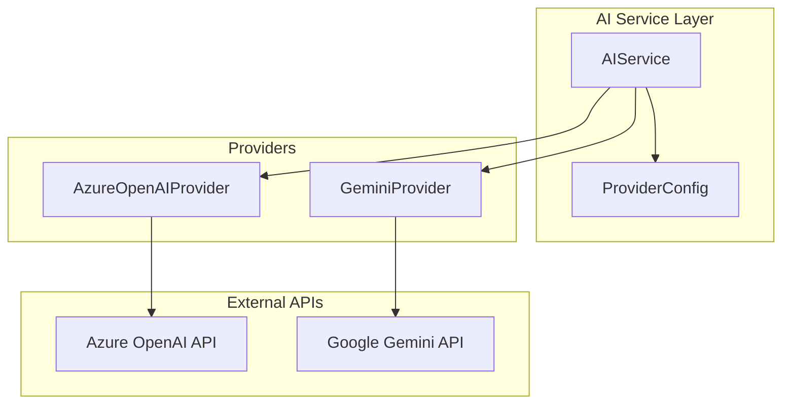

# Design Document: Azure OpenAI Integration

## Overview

本设计文档描述如何将 VAGO 应用的 AI 服务从 OpenAI Direct 迁移到 Azure OpenAI。Azure OpenAI 提供与 OpenAI 相同的模型（GPT-4o、GPT-4o-mini），但使用不同的 API 端点和认证方式。

核心变更：
- 新增 Azure OpenAI Provider 实现
- 重构 AIService 支持多 Provider 切换
- 保留 Gemini 作为 fallback

## Architecture



## Components and Interfaces

### 1. Provider Interface

定义统一的 AI Provider 接口，所有 Provider 实现此接口：

```typescript
interface AIProvider {
  name: string;
  
  // 图片识别
  identifyPlace(imageUrl: string): Promise<PlaceIdentificationResult>;
  
  // 文本生成（推荐、标签等）
  generateText(prompt: string, systemPrompt?: string): Promise<string>;
  
  // 检查 Provider 是否可用
  isAvailable(): boolean;
}

interface PlaceIdentificationResult {
  placeName: string;
  city?: string;
  country?: string;
  confidence: number;
  description?: string;
  suggestedTags?: string[];
}
```

### 2. Azure OpenAI Provider

实现 Azure OpenAI 的 API 调用：

```typescript
class AzureOpenAIProvider implements AIProvider {
  name = 'azure_openai';
  
  private endpoint: string;      // e.g., https://your-resource.openai.azure.com
  private apiKey: string;
  private apiVersion: string;    // e.g., 2024-02-15-preview
  private visionDeployment: string;  // e.g., gpt-4o
  private chatDeployment: string;    // e.g., gpt-4o-mini
  
  // Azure OpenAI URL 格式:
  // POST {endpoint}/openai/deployments/{deployment}/chat/completions?api-version={api-version}
  
  // Azure OpenAI Headers:
  // api-key: {apiKey}
  // Content-Type: application/json
}
```

### 3. AIService 重构

重构 AIService 支持多 Provider：

```typescript
class AIService {
  private providers: AIProvider[] = [];
  private preferredOrder: string[] = ['azure_openai', 'gemini'];
  
  constructor() {
    // 根据配置初始化可用的 Providers
    if (this.isAzureConfigured()) {
      this.providers.push(new AzureOpenAIProvider());
    }
    if (this.isGeminiConfigured()) {
      this.providers.push(new GeminiProvider());
    }
  }
  
  // 按优先级尝试 Provider，失败则 fallback
  async executeWithFallback<T>(
    operation: (provider: AIProvider) => Promise<T>
  ): Promise<T>;
}
```

## Data Models

### Environment Configuration

```bash
# Azure OpenAI Configuration
AZURE_OPENAI_ENDPOINT=https://your-resource.openai.azure.com
AZURE_OPENAI_API_KEY=your-api-key
AZURE_OPENAI_API_VERSION=2024-02-15-preview
AZURE_OPENAI_DEPLOYMENT_VISION=gpt-4o
AZURE_OPENAI_DEPLOYMENT_CHAT=gpt-4o-mini

# Gemini Configuration (fallback)
GEMINI_API_KEY=your-gemini-key

# Provider Order (optional, default: azure_openai,gemini)
AI_PROVIDER_ORDER=azure_openai,gemini
```

### Azure OpenAI Request Format

```typescript
// Vision Request (图片识别)
interface AzureVisionRequest {
  messages: [
    {
      role: 'system';
      content: string;
    },
    {
      role: 'user';
      content: [
        { type: 'text'; text: string },
        { type: 'image_url'; image_url: { url: string } }
      ];
    }
  ];
  max_tokens: number;
  temperature: number;
}

// Chat Request (文本生成)
interface AzureChatRequest {
  messages: Array<{
    role: 'system' | 'user' | 'assistant';
    content: string;
  }>;
  max_tokens: number;
  temperature: number;
}
```

### Azure OpenAI Response Format

```typescript
interface AzureOpenAIResponse {
  id: string;
  object: string;
  created: number;
  model: string;
  choices: Array<{
    index: number;
    message: {
      role: string;
      content: string;
    };
    finish_reason: string;
  }>;
  usage: {
    prompt_tokens: number;
    completion_tokens: number;
    total_tokens: number;
  };
}
```

## Correctness Properties

*A property is a characteristic or behavior that should hold true across all valid executions of a system—essentially, a formal statement about what the system should do. Properties serve as the bridge between human-readable specifications and machine-verifiable correctness guarantees.*

### Property 1: Configuration Loading

*For any* valid Azure OpenAI configuration (endpoint, apiKey, apiVersion, deployments), the AzureOpenAIProvider SHALL initialize successfully and report isAvailable() as true.

**Validates: Requirements 1.1, 1.2, 1.3**

### Property 2: Azure Vision Request Formatting

*For any* image URL, when Azure OpenAI is configured, the request to Azure SHALL:
- Use URL format: `{endpoint}/openai/deployments/{visionDeployment}/chat/completions?api-version={apiVersion}`
- Include header `api-key: {apiKey}`
- Include the image in the correct message format

**Validates: Requirements 2.1, 2.2, 2.3**

### Property 3: Azure Text Request Formatting

*For any* text prompt, when Azure OpenAI is configured, the request to Azure SHALL:
- Use URL format: `{endpoint}/openai/deployments/{chatDeployment}/chat/completions?api-version={apiVersion}`
- Include header `api-key: {apiKey}`
- Format messages array correctly

**Validates: Requirements 3.1, 3.2, 3.3**

### Property 4: Response Parsing Consistency

*For any* valid Azure OpenAI response, the parsed result SHALL match the standard PlaceIdentificationResult or text format, identical to what OpenAI Direct would return.

**Validates: Requirements 2.4, 3.4**

### Property 5: Fallback Chain Execution

*For any* AI operation, when the primary provider fails (error or timeout), the system SHALL:
- Retry up to 3 times for retryable errors (429, 503)
- Try the next provider in the configured order
- Return error only when all providers fail

**Validates: Requirements 4.2, 5.2, 5.3**

## Error Handling

### Retryable Errors

| Error Code | Description | Action |
|------------|-------------|--------|
| 429 | Rate Limited | Retry with exponential backoff (1s, 2s, 4s) |
| 503 | Service Unavailable | Retry with exponential backoff |
| 500 | Internal Server Error | Retry once, then fallback |

### Non-Retryable Errors

| Error Code | Description | Action |
|------------|-------------|--------|
| 401 | Unauthorized | Log error, try next provider |
| 403 | Forbidden | Log error, try next provider |
| 404 | Deployment Not Found | Log error, try next provider |
| 400 | Bad Request | Log error, return error to caller |

### Error Response Format

```typescript
interface AIServiceError {
  code: string;
  message: string;
  provider: string;
  retryable: boolean;
  details?: any;
}
```

## Testing Strategy

### Unit Tests

1. **Configuration Tests**
   - Test Azure config validation
   - Test missing config handling
   - Test provider initialization

2. **Request Formatting Tests**
   - Test Azure URL construction
   - Test header formatting
   - Test message body formatting

3. **Response Parsing Tests**
   - Test successful response parsing
   - Test error response handling

### Property-Based Tests

使用 fast-check 进行属性测试：

1. **Property 1**: Configuration Loading
   - Generate random valid configs, verify initialization
   - Generate invalid configs, verify graceful handling

2. **Property 2 & 3**: Request Formatting
   - Generate random inputs, verify request format matches Azure spec

3. **Property 4**: Response Parsing
   - Generate random valid responses, verify parsing consistency

4. **Property 5**: Fallback Chain
   - Simulate provider failures, verify fallback behavior

### Integration Tests

1. **Azure OpenAI Integration**
   - Test actual API call with test deployment
   - Verify response handling

2. **Fallback Integration**
   - Test Azure → Gemini fallback
   - Test all-provider-failure scenario
