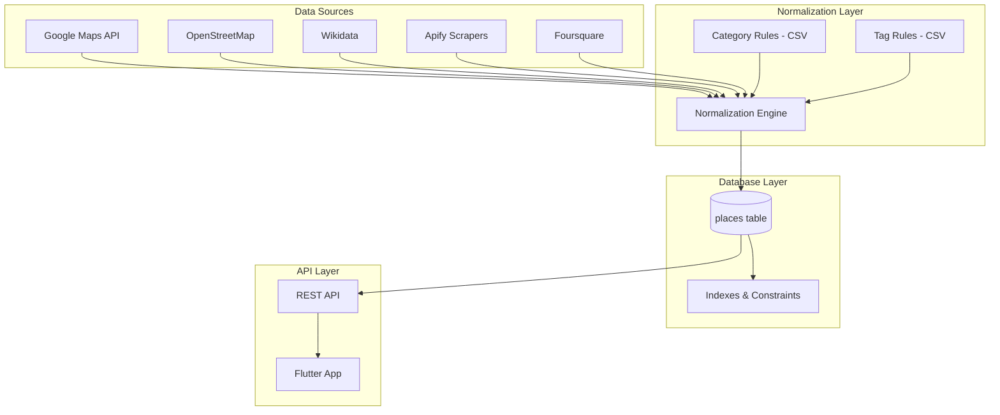

# Design Document: Category & Tags Normalization

## Overview

本设计文档描述了 Wanderlog 分类和标签系统的重构方案。核心目标是建立一套可维护、可扩展的分类规则引擎，支持多数据源（Google Maps、Apify、Wikidata、OSM、Foursquare）的数据导入和去重合并。

采用"最小增量"策略：保留现有字段兼容老数据，新增必要字段支持新规则，通过迁移脚本回填历史数据。

## Architecture



## Components and Interfaces

### 1. Database Schema Changes

新增字段到 `places` 表：

```sql
-- 新增字段
ALTER TABLE places ADD COLUMN category_slug TEXT;
ALTER TABLE places ADD COLUMN category_en TEXT;
ALTER TABLE places ADD COLUMN source_detail TEXT;

-- 唯一约束（允许 NULL）
-- google_place_id 已有唯一约束，无需修改

-- (source, source_detail) 组合唯一约束
CREATE UNIQUE INDEX idx_places_source_detail_unique 
ON places (source, source_detail) 
WHERE source IS NOT NULL AND source_detail IS NOT NULL;

-- 分类索引
CREATE INDEX idx_places_category_slug ON places (category_slug);
```

### 2. Category Slug Mapping

主分类映射表（18 个主分类）：

| category_slug | category_en | 中文 |
|---------------|-------------|------|
| landmark | Landmark | 地标 |
| museum | Museum | 博物馆 |
| art_gallery | Gallery | 美术馆 |
| shopping_mall | Shopping | 商场 |
| cafe | Cafe | 咖啡店 |
| bakery | Bakery | 面包店 |
| restaurant | Restaurant | 餐馆 |
| bar | Bar | 酒吧 |
| hotel | Hotel | 酒店 |
| church | Church | 教堂 |
| library | Library | 图书馆 |
| bookstore | Bookstore | 书店 |
| cemetery | Cemetery | 墓园 |
| park | Park | 公园 |
| castle | Castle | 城堡 |
| market | Market | 市集 |
| shop | Shop | 商店 |
| yarn_store | Yarn | 毛线店 |
| thrift_store | Thrift | 二手店 |

### 3. Tag Format Specification

结构化标签格式：

```typescript
// 标签类型定义
type TagFormat = 
  | `domain:${string}`      // domain:architecture
  | `theme:${string}`       // theme:feminism
  | `meal:${string}`        // meal:brunch
  | `style:${string}`       // style:vintage, style:brutalism
  | `architect:${string}`   // architect:Zaha Hadid
  | `alt_category:${string}` // alt_category:museum
  | `shop:${string}`        // shop:secondhand
  | `pritzker`              // 普利兹克奖标记
  | `pritzker_year:${string}` // pritzker_year:2004
  | string;                 // 其他自由标签
```

### 4. Normalization Service Interface

```typescript
interface NormalizationService {
  /**
   * 根据多源数据确定主分类
   */
  determineCategory(input: NormalizationInput): CategoryResult;
  
  /**
   * 提取并格式化标签
   */
  extractTags(input: NormalizationInput): string[];
  
  /**
   * 完整归一化流程
   */
  normalize(input: NormalizationInput): NormalizedPlace;
  
  /**
   * 合并多源数据
   */
  mergeMultiSourceData(existing: Place, newData: Partial<Place>, source: string): MergedPlace;
}

interface NormalizationInput {
  // Google Maps 数据
  googleTypes?: string[];
  googleKeywords?: string[];
  
  // OSM 数据
  osmTags?: Record<string, string>;
  
  // Wikidata 数据
  wikidataP31?: string[];  // instance of
  wikidataP84?: string;    // architect
  wikidataP149?: string;   // architectural style
  wikidataP166?: string[]; // awards (for Pritzker detection)
  wikidataP18?: string;    // image URL
  
  // Foursquare 数据
  fsqCategories?: string[];
  
  // 通用
  name: string;
  description?: string;
}

interface CategoryResult {
  categorySlug: string;
  categoryEn: string;
  confidence: number;
  matchedBy: 'google_types' | 'osm_tags' | 'wikidata_p31' | 'fsq_category' | 'keywords' | 'fallback';
}

interface NormalizedPlace {
  categorySlug: string;
  categoryEn: string;
  tags: string[];
  customFields: {
    raw?: Record<string, any>;
    originalCategory?: string;
    evidence?: Record<string, string>;
  };
}

interface MergedPlace {
  // 合并后的字段
  openingHours?: string;      // prefer Google
  address?: string;           // prefer Google
  rating?: number;            // prefer Google
  photos?: string[];          // prefer Google
  coverImage?: string;        // Google > Wikidata P18
  description?: string;       // keep richer
  tags: string[];             // union all
  images: string[];           // union all
  customFields: {
    raw: Record<string, any>; // preserve all source data
    osm_opening_hours_raw?: string;
  };
}
```

### 5. Category Priority Configuration

每个分类可以有自定义的 `mapping_priority`：

```typescript
interface CategoryPriorityConfig {
  slug: string;
  // 默认: ['google_types', 'osm_tags', 'wikidata_p31', 'fsq_category', 'keywords']
  mappingPriority: Array<'google_types' | 'osm_tags' | 'wikidata_p31' | 'fsq_category' | 'keywords'>;
}

// 特殊优先级配置
const CATEGORY_PRIORITY_OVERRIDES: Record<string, string[]> = {
  // castle: OSM 和关键词优先于 Google（因为 Google 常返回 tourist_attraction）
  castle: ['osm_tags', 'keywords', 'wikidata_p31', 'google_types', 'fsq_category'],
  // yarn_store: OSM 和关键词优先（Google 没有专门类型）
  yarn_store: ['osm_tags', 'keywords', 'fsq_category', 'google_types'],
  // thrift_store: OSM 和关键词优先（Google 没有专门类型）
  thrift_store: ['osm_tags', 'keywords', 'fsq_category', 'google_types'],
};
```

### 6. Primary Rule Exclusion Logic

`landmark` 分类的排除规则：

```typescript
// 排除列表：如果已匹配这些分类，则不应再匹配 landmark
const LANDMARK_EXCLUSION_LIST = [
  'museum', 'art_gallery', 'library', 'park', 'shopping_mall',
  'cafe', 'bakery', 'restaurant', 'bar', 'hotel', 'church',
  'castle', 'cemetery', 'market', 'bookstore', 'yarn_store', 'thrift_store'
];

// shop 分类的排除规则
const SHOP_EXCLUSION_LIST = [
  'shopping_mall', 'yarn_store', 'thrift_store', 'bookstore',
  'bakery', 'cafe', 'restaurant', 'bar', 'market'
];

function shouldExcludeCategory(
  candidateSlug: string, 
  alreadyMatched: string[]
): boolean {
  if (candidateSlug === 'landmark') {
    return alreadyMatched.some(m => LANDMARK_EXCLUSION_LIST.includes(m));
  }
  if (candidateSlug === 'shop') {
    return alreadyMatched.some(m => SHOP_EXCLUSION_LIST.includes(m));
  }
  return false;
}
```

### 7. Secondary Tag Rules

条件性标签添加规则：

```typescript
interface SecondaryTagRule {
  condition: (input: NormalizationInput, categorySlug: string) => boolean;
  tags: string[];
  evidence?: string;
}

const SECONDARY_TAG_RULES: SecondaryTagRule[] = [
  // brunch 信号 → meal:brunch
  {
    condition: (input) => hasBrunchSignals(input),
    tags: ['meal:brunch'],
    evidence: 'brunch signals detected',
  },
  // cafe + bakery → alt_category:bakery
  {
    condition: (input, slug) => slug === 'cafe' && hasBakerySignals(input),
    tags: ['alt_category:bakery'],
  },
  // bakery + cafe → alt_category:cafe
  {
    condition: (input, slug) => slug === 'bakery' && hasCafeSignals(input),
    tags: ['alt_category:cafe'],
  },
  // hotel + hostel → lodging:hostel
  {
    condition: (input, slug) => slug === 'hotel' && hasHostelSignals(input),
    tags: ['lodging:hostel'],
  },
  // architecture signals → domain:architecture + style:* + architect:*
  {
    condition: (input) => hasArchitectureSignals(input),
    tags: ['domain:architecture'],
  },
  // feminism signals → theme:feminism
  {
    condition: (input) => hasFeminismSignals(input),
    tags: ['theme:feminism'],
    evidence: 'feminism keywords detected',
  },
  // vintage signals → style:vintage
  {
    condition: (input) => hasVintageSignals(input),
    tags: ['style:vintage'],
  },
  // secondhand signals → shop:secondhand
  {
    condition: (input) => hasSecondhandSignals(input),
    tags: ['shop:secondhand'],
  },
  // park + viewpoint → alt_category:landmark
  {
    condition: (input, slug) => slug === 'park' && hasViewpointSignals(input),
    tags: ['alt_category:landmark'],
  },
  // cemetery + landmark signals → alt_category:landmark
  {
    condition: (input, slug) => slug === 'cemetery' && hasLandmarkSignals(input),
    tags: ['alt_category:landmark'],
  },
];
```

### 8. Merge Policy Implementation

多源数据合并策略：

```typescript
interface MergePolicy {
  field: string;
  strategy: 'prefer_google' | 'prefer_wikidata' | 'union' | 'keep_richer' | 'fallback_chain';
  fallbackSources?: string[];
}

const MERGE_POLICIES: MergePolicy[] = [
  { field: 'openingHours', strategy: 'prefer_google' },
  { field: 'address', strategy: 'prefer_google' },
  { field: 'rating', strategy: 'prefer_google' },
  { field: 'photos', strategy: 'prefer_google' },
  { field: 'phoneNumber', strategy: 'prefer_google' },
  { field: 'website', strategy: 'prefer_google' },
  { field: 'coverImage', strategy: 'fallback_chain', fallbackSources: ['google', 'wikidata', 'osm'] },
  { field: 'description', strategy: 'keep_richer' },
  { field: 'tags', strategy: 'union' },
  { field: 'images', strategy: 'union' },
];

function mergeField(
  field: string,
  sources: Record<string, any>,
  policy: MergePolicy
): any {
  switch (policy.strategy) {
    case 'prefer_google':
      return sources.google?.[field] ?? sources.osm?.[field] ?? sources.wikidata?.[field];
    
    case 'prefer_wikidata':
      return sources.wikidata?.[field] ?? sources.google?.[field] ?? sources.osm?.[field];
    
    case 'union':
      const arrays = Object.values(sources).map(s => s?.[field] || []);
      return [...new Set(arrays.flat())];
    
    case 'keep_richer':
      const values = Object.values(sources).map(s => s?.[field]).filter(Boolean);
      return values.sort((a, b) => (b?.length || 0) - (a?.length || 0))[0];
    
    case 'fallback_chain':
      for (const source of policy.fallbackSources || []) {
        if (sources[source]?.[field]) return sources[source][field];
      }
      return null;
  }
}
```

### 9. Pritzker Prize Detection

普利兹克奖检测逻辑：

```typescript
// 已知的普利兹克奖获奖建筑师列表（可从 Wikidata 查询）
const PRITZKER_ARCHITECTS: Record<string, number> = {
  'Philip Johnson': 1979,
  'Luis Barragán': 1980,
  'James Stirling': 1981,
  'Kevin Roche': 1982,
  'I. M. Pei': 1983,
  'Richard Meier': 1984,
  'Hans Hollein': 1985,
  'Gottfried Böhm': 1986,
  'Kenzo Tange': 1987,
  'Gordon Bunshaft': 1988,
  'Oscar Niemeyer': 1988,
  'Frank Gehry': 1989,
  'Aldo Rossi': 1990,
  'Robert Venturi': 1991,
  'Álvaro Siza': 1992,
  'Fumihiko Maki': 1993,
  'Christian de Portzamparc': 1994,
  'Tadao Ando': 1995,
  'Rafael Moneo': 1996,
  'Sverre Fehn': 1997,
  'Renzo Piano': 1998,
  'Norman Foster': 1999,
  'Rem Koolhaas': 2000,
  'Herzog & de Meuron': 2001,
  'Glenn Murcutt': 2002,
  'Jørn Utzon': 2003,
  'Zaha Hadid': 2004,
  'Thom Mayne': 2005,
  'Paulo Mendes da Rocha': 2006,
  'Richard Rogers': 2007,
  'Jean Nouvel': 2008,
  'Peter Zumthor': 2009,
  'SANAA': 2010,
  'Eduardo Souto de Moura': 2011,
  'Wang Shu': 2012,
  'Toyo Ito': 2013,
  'Shigeru Ban': 2014,
  'Frei Otto': 2015,
  'Alejandro Aravena': 2016,
  'RCR Arquitectes': 2017,
  'Balkrishna Doshi': 2018,
  'Arata Isozaki': 2019,
  'Yvonne Farrell': 2020,
  'Shelley McNamara': 2020,
  'Anne Lacaton': 2021,
  'Jean-Philippe Vassal': 2021,
  'Diébédo Francis Kéré': 2022,
  'David Chipperfield': 2023,
  'Riken Yamamoto': 2024,
};

function detectPritzkerTags(architectName: string): string[] {
  const tags: string[] = [];
  const year = PRITZKER_ARCHITECTS[architectName];
  if (year) {
    tags.push('pritzker');
    tags.push(`pritzker_year:${year}`);
  }
  return tags;
}
```

### 5. Migration Script Interface

```typescript
interface MigrationService {
  /**
   * 迁移单条记录
   */
  migratePlace(place: Place): MigrationResult;
  
  /**
   * 批量迁移所有历史数据
   */
  migrateAll(): MigrationReport;
}

interface MigrationResult {
  placeId: string;
  oldCategory: string | null;
  newCategorySlug: string;
  newCategoryEn: string;
  migratedTags: string[];
  preserved: boolean;
}

interface MigrationReport {
  total: number;
  migrated: number;
  skipped: number;
  errors: Array<{ placeId: string; error: string }>;
  unmappedCategories: string[];
}
```

## Data Models

### Updated Place Model (Prisma)

```prisma
model Place {
  id             String    @id @default(dbgenerated("gen_random_uuid()")) @db.Uuid
  name           String
  city           String?
  country        String?
  latitude       Float
  longitude      Float
  address        String?
  description    String?
  openingHours   String?   @map("opening_hours")
  rating         Float?
  ratingCount    Int?      @map("rating_count")
  
  // 分类字段（新增 + 保留）
  category       String?                    // 保留，向后兼容
  categorySlug   String?   @map("category_slug")  // 新增：机器键
  categoryEn     String?   @map("category_en")    // 新增：英文展示名
  
  // 标签字段（保留）
  aiSummary      String?   @map("ai_summary")
  aiDescription  String?   @map("ai_description")
  tags           Json?     @default("[]")
  aiTags         Json?     @default("[]") @map("ai_tags")
  
  // 媒体字段（保留）
  coverImage     String?   @map("cover_image")
  photoReference String?   @map("photo_reference")
  images         Json?     @default("[]")
  
  // 元数据字段
  priceLevel     Int?      @map("price_level")
  website        String?
  phoneNumber    String?   @map("phone_number")
  googlePlaceId  String?   @unique @map("google_place_id")
  source         String?   @default("google_maps")
  sourceDetail   String?   @map("source_detail")  // 新增：源详细标识
  isVerified     Boolean   @default(false) @map("is_verified")
  customFields   Json?     @map("custom_fields")
  lastSyncedAt   DateTime? @map("last_synced_at")
  createdAt      DateTime  @default(now()) @map("created_at")
  updatedAt      DateTime  @default(now()) @map("updated_at")

  collectionSpots CollectionSpot[]

  @@index([city])
  @@index([category])
  @@index([categorySlug])  // 新增索引
  @@index([rating])
  @@index([isVerified])
  @@index([source, sourceDetail])  // 新增组合索引
  @@map("places")
}
```

### Old Category to New Mapping

```typescript
const CATEGORY_MIGRATION_MAP: Record<string, { slug: string; tags?: string[] }> = {
  // 直接映射
  'cafe': { slug: 'cafe' },
  'coffee': { slug: 'cafe' },
  'museum': { slug: 'museum' },
  'art_gallery': { slug: 'art_gallery' },
  'gallery': { slug: 'art_gallery' },
  'restaurant': { slug: 'restaurant' },
  'bar': { slug: 'bar' },
  'hotel': { slug: 'hotel' },
  'church': { slug: 'church' },
  'library': { slug: 'library' },
  'bookstore': { slug: 'bookstore' },
  'park': { slug: 'park' },
  'shopping': { slug: 'shopping_mall' },
  'market': { slug: 'market' },
  'shop': { slug: 'shop' },
  'store': { slug: 'shop' },
  
  // 迁移到标签
  'brunch': { slug: 'restaurant', tags: ['meal:brunch'] },
  'vintage': { slug: 'shop', tags: ['style:vintage'] },
  'architecture': { slug: 'landmark', tags: ['domain:architecture'] },
  'architecture_work': { slug: 'landmark', tags: ['domain:architecture'] },
  'feminist': { slug: 'bookstore', tags: ['theme:feminism'] },
  'secondhand': { slug: 'thrift_store', tags: ['shop:secondhand'] },
  'thrift': { slug: 'thrift_store' },
  'yarn': { slug: 'yarn_store' },
  'cemetery': { slug: 'cemetery' },
  'castle': { slug: 'castle' },
  
  // 默认
  'landmark': { slug: 'landmark' },
  'attraction': { slug: 'landmark' },
  'tourist_attraction': { slug: 'landmark' },
};
```

## Correctness Properties

*A property is a characteristic or behavior that should hold true across all valid executions of a system-essentially, a formal statement about what the system should do. Properties serve as the bridge between human-readable specifications and machine-verifiable correctness guarantees.*


### Property 1: Category Slug Uniqueness Constraint

*For any* two places in the database with non-null `google_place_id`, the `google_place_id` values must be different. Attempting to insert a duplicate should result in a constraint violation error.

**Validates: Requirements 4.1, 4.3**

### Property 2: Source-Detail Combination Uniqueness

*For any* two places in the database with non-null `source` and `source_detail`, the combination `(source, source_detail)` must be unique. Attempting to insert a duplicate combination should result in a constraint violation error.

**Validates: Requirements 4.2, 4.4**

### Property 3: Category Priority Resolution

*For any* normalization input with signals from multiple sources (google_types, osm_tags, wikidata_p31, fsq_category, keywords), the resulting `category_slug` must be determined by the highest priority source that provides a match, following the category-specific `mapping_priority` order.

**Validates: Requirements 2.3, 2.5, 6.1**

### Property 4: Multiple Category Handling

*For any* normalization input that matches multiple primary categories, the result must have exactly one `category_slug` and all other matched categories must appear as `alt_category:<slug>` tags.

**Validates: Requirements 2.2**

### Property 5: Structured Tag Format Validation

*For any* tag in the `tags` array that uses a structured format (domain:, theme:, meal:, style:, architect:, alt_category:, shop:, lodging:, typology:, pritzker_year:), the tag must match its defined pattern: `<prefix>:<value>` where value is non-empty.

**Validates: Requirements 3.1, 3.2, 3.3, 3.4, 3.5, 3.6, 3.7, 3.11, 3.12**

### Property 6: Architecture Signal Detection

*For any* place with architecture signals (Wikidata P84 architect, P149 architectural style, or OSM architect:wikidata tag), the `tags` array must contain `domain:architecture`.

**Validates: Requirements 3.8**

### Property 7: Category Migration Correctness

*For any* place with an old category value in the migration mapping table, after migration: (1) `category_slug` equals the mapped slug, (2) if the mapping includes tags, those tags are present in the `tags` array, (3) `custom_fields.original_category` equals the pre-migration category value.

**Validates: Requirements 5.1, 5.2, 5.3, 5.4, 5.5**

### Property 8: Fallback Category Assignment

*For any* normalization input that does not match any specific category rule, the resulting `category_slug` must be either `landmark` (if tourist attraction signals present) or `shop` (otherwise).

**Validates: Requirements 2.4, 6.5**

### Property 9: API Backward Compatibility

*For any* API response for a place: (1) the `category` field is always present, (2) if `category_slug` is set, both `category_slug` and `category_en` are returned, (3) if `category_slug` is set but `category` was null, `category` is populated from `category_en`, (4) `tags` is always an array of strings.

**Validates: Requirements 7.1, 7.2, 7.3, 7.4**

### Property 10: Raw Data Preservation

*For any* normalized place, `custom_fields.raw` must contain the original source data (google_types, osm_tags, etc.) that was used for normalization.

**Validates: Requirements 6.3**

### Property 11: Landmark Exclusion Rule

*For any* normalization input that matches both `landmark` and any category in the exclusion list (museum, art_gallery, library, park, etc.), the resulting `category_slug` must NOT be `landmark`.

**Validates: Requirements 2.6**

### Property 12: Art Gallery Museum Precedence

*For any* normalization input that matches both `art_gallery` and `museum`, the resulting `category_slug` must be `art_gallery` and `tags` must contain `alt_category:museum`.

**Validates: Requirements 2.7**

### Property 13: Pritzker Tag Detection

*For any* place with an architect name that matches a Pritzker Prize winner, the `tags` array must contain both `pritzker` and `pritzker_year:<YYYY>` with the correct year.

**Validates: Requirements 3.9, 3.10**

### Property 14: Merge Policy - Google Preference

*For any* place with data from multiple sources, the fields `openingHours`, `address`, `rating`, `photos` must prefer Google Maps data when available.

**Validates: Requirements 8.1**

### Property 15: Merge Policy - Union Arrays

*For any* place with data from multiple sources, the `tags` and `images` arrays must be the union of all source arrays (no duplicates).

**Validates: Requirements 8.2**

### Property 16: Merge Policy - Richer Description

*For any* place with descriptions from multiple sources, the final `description` must be the longest (richest) one.

**Validates: Requirements 8.3**

### Property 17: Merge Policy - Cover Image Fallback

*For any* place where Google Maps lacks a cover image but Wikidata has P18, the `coverImage` must be populated from Wikidata P18.

**Validates: Requirements 8.4**

### Property 18: Secondary Tag Rules Application

*For any* normalization input that meets a secondary tag rule condition (e.g., brunch signals, vintage signals), the corresponding tags must be added to the `tags` array.

**Validates: Requirements 3.13**

### Property 19: Tag Evidence Preservation

*For any* tag added based on keyword/signal detection, the evidence must be stored in `custom_fields.evidence_<tag>`.

**Validates: Requirements 3.14**

### Property 20: Castle Custom Priority

*For any* normalization input with castle signals, the category determination must follow the custom priority order: `osm_tags > keywords > wikidata_p31 > google_types > fsq_category`.

**Validates: Requirements 2.5**

## Error Handling

### Database Constraint Violations

```typescript
// 处理唯一约束冲突
async function handleDuplicatePlace(error: PrismaClientKnownRequestError, place: PlaceInput): Promise<Place> {
  if (error.code === 'P2002') {
    // 唯一约束冲突
    const target = error.meta?.target as string[];
    
    if (target?.includes('google_place_id')) {
      // Google Place ID 重复，尝试合并
      const existing = await prisma.place.findUnique({
        where: { googlePlaceId: place.googlePlaceId }
      });
      return mergePlace(existing, place);
    }
    
    if (target?.includes('source') && target?.includes('source_detail')) {
      // Source + Detail 重复，尝试合并
      const existing = await prisma.place.findFirst({
        where: { source: place.source, sourceDetail: place.sourceDetail }
      });
      return mergePlace(existing, place);
    }
  }
  throw error;
}
```

### Normalization Failures

```typescript
// 归一化失败处理
function handleNormalizationError(input: NormalizationInput, error: Error): NormalizedPlace {
  console.warn(`Normalization failed for ${input.name}: ${error.message}`);
  
  // 返回安全的默认值
  return {
    categorySlug: 'shop',
    categoryEn: 'Shop',
    tags: [],
    customFields: {
      raw: input,
      normalizationError: error.message,
    },
  };
}
```

### Migration Errors

```typescript
// 迁移错误处理
interface MigrationError {
  placeId: string;
  oldCategory: string | null;
  error: string;
  recoverable: boolean;
}

function handleMigrationError(place: Place, error: Error): MigrationError {
  return {
    placeId: place.id,
    oldCategory: place.category,
    error: error.message,
    recoverable: error.message.includes('unmapped category'),
  };
}
```

## Testing Strategy

### Unit Tests

1. **Category Mapping Tests**
   - Test each of the 18 primary categories maps correctly
   - Test old category to new slug mapping
   - Test fallback behavior for unknown categories

2. **Tag Extraction Tests**
   - Test domain:architecture detection from Wikidata P84/P149
   - Test theme:feminism detection from keywords
   - Test meal:brunch detection from Google types
   - Test style:vintage detection from OSM tags

3. **Migration Tests**
   - Test single place migration
   - Test batch migration
   - Test error recovery

### Property-Based Tests

使用 `fast-check` 库进行属性测试：

1. **Property 1 & 2**: 生成随机 place 数据，验证唯一约束
2. **Property 3**: 生成随机多源输入，验证优先级规则
3. **Property 4**: 生成匹配多分类的输入，验证 alt_category 处理
4. **Property 5**: 生成随机标签，验证格式正确性
5. **Property 6**: 生成带建筑信号的输入，验证 domain:architecture 添加
6. **Property 7**: 生成旧分类数据，验证迁移正确性
7. **Property 8**: 生成无匹配输入，验证 fallback 行为
8. **Property 9**: 生成 API 响应，验证向后兼容性
9. **Property 10**: 生成归一化输入，验证原始数据保留

### Integration Tests

1. **End-to-End Import Flow**
   - 从 Google Maps 导入 → 归一化 → 存储 → API 返回
   - 从 OSM 导入 → 归一化 → 存储 → API 返回
   - 多源合并场景

2. **Migration Integration**
   - 完整数据库迁移测试
   - 迁移后 API 兼容性测试

## Implementation Notes

### Supabase SQL Migration (Minimal Change Version)

```sql
-- Step 1: Add new columns
ALTER TABLE places ADD COLUMN IF NOT EXISTS category_slug TEXT;
ALTER TABLE places ADD COLUMN IF NOT EXISTS category_en TEXT;
ALTER TABLE places ADD COLUMN IF NOT EXISTS source_detail TEXT;

-- Step 2: Create indexes
CREATE INDEX IF NOT EXISTS idx_places_category_slug ON places (category_slug);

-- Step 3: Create unique constraint for (source, source_detail)
-- Using partial unique index to allow NULLs
CREATE UNIQUE INDEX IF NOT EXISTS idx_places_source_detail_unique 
ON places (source, source_detail) 
WHERE source IS NOT NULL AND source_detail IS NOT NULL;

-- Step 4: Verify google_place_id unique constraint exists
-- (Already exists in schema, no action needed)
```

### Category Slug to English Name Mapping

```typescript
const CATEGORY_DISPLAY_NAMES: Record<string, string> = {
  landmark: 'Landmark',
  museum: 'Museum',
  art_gallery: 'Gallery',
  shopping_mall: 'Shopping',
  cafe: 'Cafe',
  bakery: 'Bakery',
  restaurant: 'Restaurant',
  bar: 'Bar',
  hotel: 'Hotel',
  church: 'Church',
  library: 'Library',
  bookstore: 'Bookstore',
  cemetery: 'Cemetery',
  park: 'Park',
  castle: 'Castle',
  market: 'Market',
  shop: 'Shop',
  yarn_store: 'Yarn',
  thrift_store: 'Thrift',
};
```
