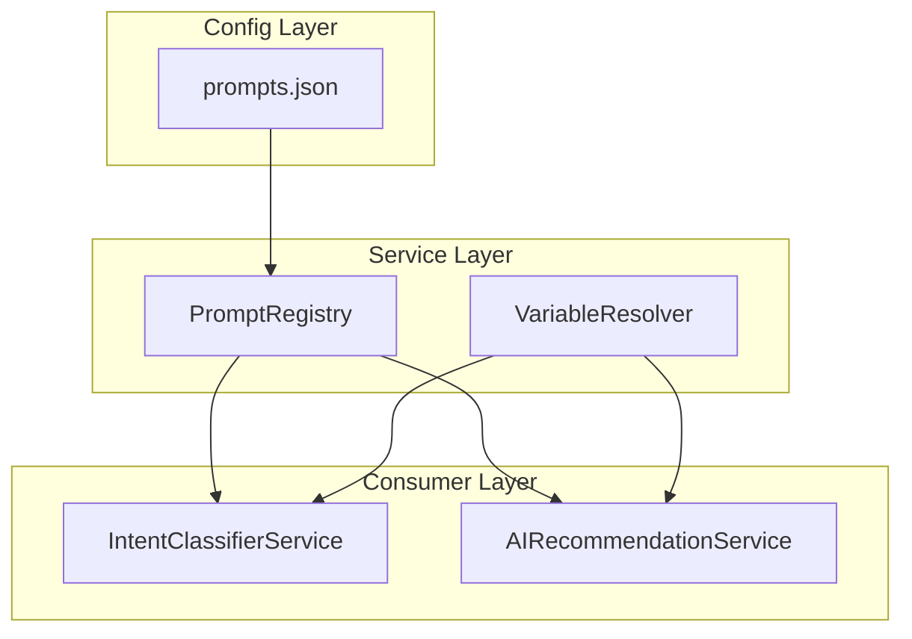

# Design Document: Intent-Prompt Management

## Overview

本设计实现一个 Intent-Prompt 管理系统，将所有 AI prompt 模板从硬编码迁移到配置文件，支持变量替换，使 prompt 的维护和迭代更加便捷。

系统包含三个核心组件：
1. **Prompt Config** - JSON 配置文件，存储所有 prompt 模板
2. **Variable Resolver** - 变量解析器，处理模板中的占位符替换
3. **Prompt Registry** - 注册服务，加载、缓存和检索 prompt

## Architecture



## Components and Interfaces

### 1. Prompt Configuration Schema

```typescript
// src/types/prompt.ts

/**
 * Variable definition in a prompt template
 */
interface PromptVariable {
  name: string;           // Variable name (e.g., "query", "language")
  description: string;    // What this variable represents
  required: boolean;      // Whether this variable must be provided
}

/**
 * Single prompt definition
 */
interface PromptDefinition {
  id: string;             // Unique ID within intent (e.g., "classification", "description")
  purpose: string;        // Human-readable description of what this prompt does
  template: string;       // The prompt template with {variable} placeholders
  variables: PromptVariable[];  // Variables used in this template
}

/**
 * Intent configuration with its prompts
 */
interface IntentConfig {
  intentType: IntentType; // "general_search" | "specific_place" | "travel_consultation" | "non_travel"
  name: string;           // Human-readable name
  description: string;    // What this intent handles
  prompts: PromptDefinition[];
}

/**
 * Root configuration structure
 */
interface PromptConfig {
  version: string;        // Config version for compatibility
  intents: IntentConfig[];
}
```

### 2. Variable Resolver

```typescript
// src/services/variableResolverService.ts

interface VariableValues {
  [key: string]: string;
}

interface IVariableResolver {
  /**
   * Replace variables in template with provided values
   * @param template - Template string with {variable} placeholders
   * @param values - Key-value pairs for replacement
   * @param declaredVariables - List of declared variable names (for validation)
   * @returns Resolved string with variables replaced
   * @throws Error if required variable is missing
   */
  resolve(template: string, values: VariableValues, declaredVariables?: string[]): string;
  
  /**
   * Extract all variable names from a template
   * @param template - Template string
   * @returns Array of variable names found
   */
  extractVariables(template: string): string[];
  
  /**
   * Validate that all declared variables exist in template
   * @param template - Template string
   * @param declaredVariables - List of declared variable names
   * @returns Validation result with any warnings
   */
  validate(template: string, declaredVariables: string[]): ValidationResult;
}

interface ValidationResult {
  valid: boolean;
  warnings: string[];     // Variables declared but not in template
  errors: string[];       // Variables in template but not declared
}
```

### 3. Prompt Registry

```typescript
// src/services/promptRegistryService.ts

interface IPromptRegistry {
  /**
   * Load prompts from configuration file
   * @throws Error if config is invalid
   */
  load(): void;
  
  /**
   * Get a specific prompt by intent type and prompt ID
   * @param intentType - The intent type
   * @param promptId - The prompt ID within the intent
   * @returns The prompt definition
   * @throws Error if not found
   */
  getPrompt(intentType: IntentType, promptId: string): PromptDefinition;
  
  /**
   * Get all prompts for an intent type
   * @param intentType - The intent type
   * @returns Array of prompt definitions
   */
  getPromptsForIntent(intentType: IntentType): PromptDefinition[];
  
  /**
   * Get resolved prompt with variables replaced
   * @param intentType - The intent type
   * @param promptId - The prompt ID
   * @param values - Variable values to inject
   * @returns Resolved prompt string
   */
  getResolvedPrompt(intentType: IntentType, promptId: string, values: VariableValues): string;
  
  /**
   * Reload prompts from file (for hot-reload)
   */
  reload(): void;
}
```

## Data Models

### Configuration File Structure

```json
// src/config/prompts.json
{
  "version": "1.0.0",
  "intents": [
    {
      "intentType": "general_search",
      "name": "General Search",
      "description": "Finding multiple places with criteria",
      "prompts": [
        {
          "id": "classification",
          "purpose": "Classify user query into intent types",
          "template": "Analyze this query and determine the user's intent.\n\nQuery: \"{query}\"\n\nClassify into ONE of these intents:\n...",
          "variables": [
            { "name": "query", "description": "User's search query", "required": true }
          ]
        }
      ]
    },
    {
      "intentType": "specific_place",
      "name": "Specific Place",
      "description": "Getting info about a specific named place",
      "prompts": [
        {
          "id": "description",
          "purpose": "Generate a brief description of a specific place",
          "template": "Write a brief, engaging introduction about \"{placeName}\" for a traveler.\n\nRequirements:\n1. Include what it is and why it's notable\n2. Add a practical tip for visitors if relevant\n3. Keep it 2-3 sentences, STRICTLY under 60 words\n4. Be informative but concise\n5. CRITICAL: You MUST respond ONLY in {language}. Do NOT use any other language.\n\nReturn ONLY the description text, no JSON or formatting.",
          "variables": [
            { "name": "placeName", "description": "Name of the specific place", "required": true },
            { "name": "language", "description": "Response language (Chinese/English)", "required": true }
          ]
        }
      ]
    },
    {
      "intentType": "travel_consultation",
      "name": "Travel Consultation",
      "description": "Travel advice without specific place requests",
      "prompts": [
        {
          "id": "response",
          "purpose": "Generate travel consultation response with place mentions",
          "template": "You are a friendly travel expert. Answer the user's travel question.\n\nQuery: \"{query}\"\nLanguage: {language}\n\nRequirements:\n1. Provide a helpful, engaging response in Markdown format\n2. Use headings (##, ###) for structure when appropriate\n3. Use emoji to make it friendly 🌍✈️🏛️\n4. Keep response concise but informative (200-400 words)\n5. When mentioning specific places, include the city they belong to\n6. At the end, you may add a prompt like \"想了解具体地点推荐吗？\" or \"Would you like specific place recommendations?\"\n\nReturn JSON:\n{\"textContent\": \"Your Markdown response here...\", \"mentionedPlaces\": [{\"name\": \"Place Name 1\", \"city\": \"City Name\"}], \"cities\": [\"City1\", \"City2\"]}",
          "variables": [
            { "name": "query", "description": "User's travel question", "required": true },
            { "name": "language", "description": "Response language (Chinese/English)", "required": true }
          ]
        }
      ]
    },
    {
      "intentType": "non_travel",
      "name": "Non-Travel",
      "description": "Non-travel related queries",
      "prompts": [
        {
          "id": "response",
          "purpose": "Generate helpful response for non-travel queries",
          "template": "You are a helpful assistant. Answer the user's question.\n\nQuery: \"{query}\"\nLanguage: {language}\n\nRequirements:\n1. Provide a helpful response in Markdown format\n2. Use headings (##, ###) for structure when appropriate\n3. Use emoji where appropriate\n4. Keep response concise but helpful\n\nReturn the response as plain Markdown text (not JSON).",
          "variables": [
            { "name": "query", "description": "User's question", "required": true },
            { "name": "language", "description": "Response language (Chinese/English)", "required": true }
          ]
        }
      ]
    }
  ]
}
```

## Correctness Properties

*A property is a characteristic or behavior that should hold true across all valid executions of a system—essentially, a formal statement about what the system should do. Properties serve as the bridge between human-readable specifications and machine-verifiable correctness guarantees.*

### Property 1: Config Structure Validation

*For any* valid prompt configuration, every intent definition SHALL contain `intentType`, `name`, `description`, and `prompts` array, and every prompt definition SHALL contain `id`, `purpose`, `template`, and `variables` array.

**Validates: Requirements 1.3, 1.4**

### Property 2: Variable Declaration Completeness

*For any* prompt template, all `{variableName}` patterns (excluding JSON structure patterns) SHALL be declared in the `variables` array.

**Validates: Requirements 1.5**

### Property 3: Variable Replacement Correctness

*For any* template string and complete set of variable values, the Variable_Resolver SHALL replace all declared `{variableName}` patterns with their corresponding values, and the result SHALL not contain any of the original placeholders.

**Validates: Requirements 2.1**

### Property 4: Missing Variable Error Handling

*For any* template with required variables and an incomplete set of values, the Variable_Resolver SHALL throw an error that includes the name of the missing variable.

**Validates: Requirements 2.5**

### Property 5: JSON Pattern Preservation

*For any* template containing JSON structure patterns like `{"key": "value"}`, the Variable_Resolver SHALL preserve these patterns unchanged while still replacing declared variables.

**Validates: Requirements 2.6**

### Property 6: Prompt Retrieval Correctness

*For any* valid intentType and promptId combination that exists in the configuration, `getPrompt(intentType, promptId)` SHALL return the exact prompt definition from the config.

**Validates: Requirements 3.2**

### Property 7: Intent Prompts Retrieval

*For any* valid intentType, `getPromptsForIntent(intentType)` SHALL return all prompts defined for that intent in the configuration.

**Validates: Requirements 3.3**

### Property 8: Invalid Prompt Error Handling

*For any* intentType or promptId that does not exist in the configuration, the Prompt_Registry SHALL throw an error containing the invalid intentType and/or promptId.

**Validates: Requirements 3.4**

### Property 9: Prompt ID Uniqueness

*For any* intent in the configuration, all prompt IDs within that intent SHALL be unique.

**Validates: Requirements 4.5**

### Property 10: Backward Compatibility

*For any* query processed by the migrated system, the API response structure SHALL be identical to the response structure produced by the original hardcoded prompt system.

**Validates: Requirements 5.3**

### Property 11: Comprehensive Config Validation

*For any* prompt configuration loaded by the Prompt_Registry, validation SHALL detect: (a) missing required fields, (b) declared variables not present in template, and (c) template variables not declared in variables array.

**Validates: Requirements 6.1, 6.2, 6.5**

## Error Handling

### Configuration Errors

| Error Type | Handling Strategy |
|------------|-------------------|
| Config file not found | Fall back to hardcoded defaults, log warning |
| Invalid JSON syntax | Fall back to hardcoded defaults, log error |
| Missing required fields | Fall back to hardcoded defaults, log validation errors |
| Undeclared variables in template | Log warning, continue with config |

### Runtime Errors

| Error Type | Handling Strategy |
|------------|-------------------|
| Missing required variable value | Throw error with variable name |
| Invalid intent type | Throw error with intent type |
| Invalid prompt ID | Throw error with intent type and prompt ID |

## Testing Strategy

### Unit Tests

1. **VariableResolver Tests**
   - Test basic variable replacement
   - Test multiple variables in one template
   - Test missing required variable throws error
   - Test JSON pattern preservation
   - Test edge cases (empty template, no variables)

2. **PromptRegistry Tests**
   - Test loading valid config
   - Test getPrompt returns correct prompt
   - Test getPromptsForIntent returns all prompts
   - Test invalid intent/prompt throws error
   - Test fallback to defaults on invalid config

### Property-Based Tests

Property tests will use fast-check to generate random configurations and verify invariants:

1. **Config Structure Property Test** - Generate random configs and verify structure validation
2. **Variable Replacement Property Test** - Generate random templates and values, verify replacement
3. **JSON Preservation Property Test** - Generate templates with JSON, verify preservation
4. **Retrieval Correctness Property Test** - Generate configs, verify retrieval matches

### Integration Tests

1. Test IntentClassifierService uses PromptRegistry correctly
2. Test end-to-end flow from query to response
3. Test backward compatibility with existing API responses

