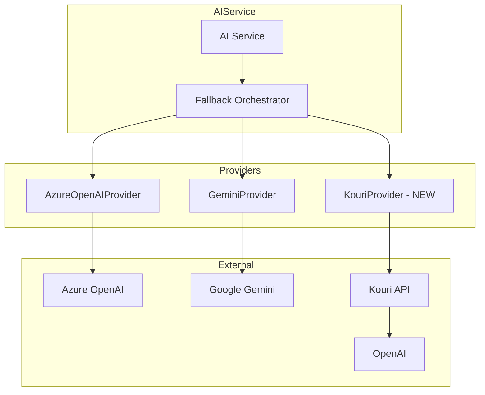

# Design Document: Kouri OpenAI Proxy Integration

## Overview

本设计文档描述如何将 Kouri API 中转服务集成到现有的多 AI Provider 架构中。Kouri 提供 OpenAI 兼容的 API 接口，使中国大陆用户可以访问 GPT-4o-mini 等模型。

设计目标：
- 创建 KouriProvider 类实现 AIProvider 接口
- 复用现有的错误处理和重试机制
- 支持 text generation 和 vision（图片识别）功能
- 通过环境变量灵活配置

## Architecture



## Components and Interfaces

### KouriProvider

新增的 Provider 类，实现 `AIProvider` 接口：

```typescript
interface KouriConfig {
  apiKey: string;
  baseUrl: string;
  chatModel: string;      // 默认: gpt-4o-mini
  visionModel: string;    // 默认: gpt-4o
}

class KouriProvider implements AIProvider {
  readonly name = AIProviderName.KOURI;
  
  // 实现 AIProvider 接口
  identifyPlace(imageUrl: string): Promise<PlaceIdentificationResult>;
  generateText(prompt: string, systemPrompt?: string): Promise<string>;
  isAvailable(): boolean;
}
```

### 环境变量配置

```bash
# Kouri API 配置（必填）
KOURI_API_KEY=your-api-key
KOURI_BASE_URL=https://your-kouri-endpoint/v1  # 必填，从 Kouri 控制台获取

# Kouri API 配置（可选，有默认值）
KOURI_CHAT_MODEL=gpt-4o-mini                  # 默认值
KOURI_VISION_MODEL=gpt-4o                     # 默认值

# Provider 顺序配置（新增 kouri 选项）
AI_PROVIDER_ORDER=kouri,gemini,azure_openai
```

### AIProviderName 枚举扩展

```typescript
export enum AIProviderName {
  AZURE_OPENAI = 'azure_openai',
  GEMINI = 'gemini',
  KOURI = 'kouri',  // 新增
}
```

## Data Models

### OpenAI 兼容请求格式

Kouri 使用标准 OpenAI API 格式：

```typescript
// Chat Completion 请求
interface OpenAIChatRequest {
  model: string;
  messages: Array<{
    role: 'system' | 'user' | 'assistant';
    content: string | Array<{
      type: 'text' | 'image_url';
      text?: string;
      image_url?: { url: string };
    }>;
  }>;
  max_tokens?: number;
  temperature?: number;
}

// Chat Completion 响应
interface OpenAIChatResponse {
  id: string;
  object: string;
  created: number;
  model: string;
  choices: Array<{
    index: number;
    message: {
      role: string;
      content: string;
    };
    finish_reason: string;
  }>;
  usage: {
    prompt_tokens: number;
    completion_tokens: number;
    total_tokens: number;
  };
}
```

## Correctness Properties

*A property is a characteristic or behavior that should hold true across all valid executions of a system-essentially, a formal statement about what the system should do. Properties serve as the bridge between human-readable specifications and machine-verifiable correctness guarantees.*

### Property 1: Request Format Compliance

*For any* valid prompt and system prompt combination, the generated request body SHALL conform to OpenAI Chat Completion API format with correct message structure.

**Validates: Requirements 1.4, 5.3**

### Property 2: Error Code Mapping

*For any* HTTP error status code returned by the API, the provider SHALL map it to the correct AIErrorCode with appropriate retryable flag (429, 503, 500 → retryable; 401, 403, 404, 400 → non-retryable).

**Validates: Requirements 3.3, 4.1, 4.2, 4.3**

### Property 3: URL Construction

*For any* valid configuration (base URL and model), the constructed API endpoint URL SHALL be `{baseUrl}/chat/completions` with proper formatting.

**Validates: Requirements 1.5, 2.2**

## Error Handling

### 错误映射策略

| HTTP Status | AIErrorCode | Retryable | 说明 |
|-------------|-------------|-----------|------|
| 429 | RATE_LIMITED | Yes | 请求过多，需要等待 |
| 503 | SERVICE_UNAVAILABLE | Yes | 服务暂时不可用 |
| 500 | INTERNAL_ERROR | Yes | 服务器内部错误 |
| 401 | UNAUTHORIZED | No | API Key 无效 |
| 403 | FORBIDDEN | No | 无权限访问 |
| 404 | NOT_FOUND | No | 模型不存在 |
| 400 | BAD_REQUEST | No | 请求格式错误 |
| Timeout | TIMEOUT | Yes | 请求超时 |

### 超时配置

- 默认超时：30 秒
- Vision 请求超时：45 秒（图片处理需要更长时间）

## Testing Strategy

### 单元测试

使用 Jest 进行单元测试，覆盖：
- 配置加载和验证
- 请求构建
- 响应解析
- 错误处理

### Property-Based Tests

使用 fast-check 进行属性测试：
- 每个属性测试运行 100+ 次迭代
- 测试标注格式：`**Feature: kouri-openai-proxy, Property N: {property_text}**`

### 测试文件结构

```
wanderlog_api/tests/aiProviders/
├── KouriProvider.test.ts      # 单元测试
└── KouriProvider.property.ts  # 属性测试（可选）
```

### Mock 策略

- 使用 nock 或 axios-mock-adapter mock HTTP 请求
- 不依赖真实 API 进行测试
