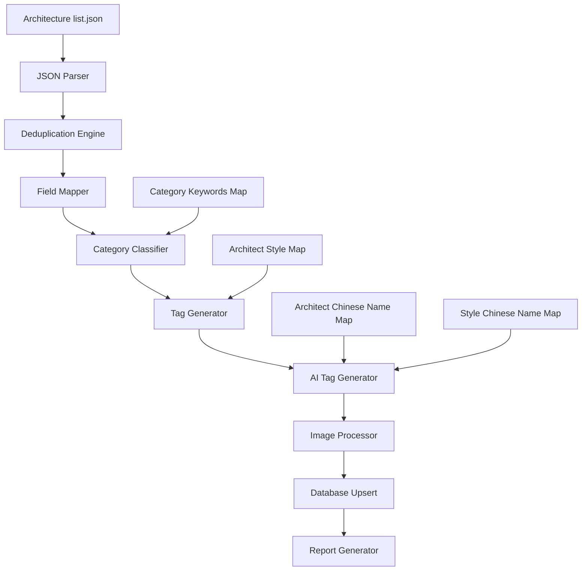

# Design Document: Pritzker Architecture Import

## Overview

本设计文档描述普利兹克奖建筑作品导入系统的技术实现方案。系统将解析 Wikidata 抓取的 JSON 数据，进行去重、字段映射、分类识别、标签生成，最终导入到 Place 数据库。

## Architecture



## Components and Interfaces

### 1. WikidataArchitectureEntry (输入数据类型)

```typescript
interface WikidataArchitectureEntry {
  architect: string;      // Wikidata URL, e.g., "http://www.wikidata.org/entity/Q134165"
  architectLabel: string; // 建筑师名称, e.g., "Oscar Niemeyer"
  work: string;           // Wikidata URL, e.g., "http://www.wikidata.org/entity/Q281521"
  workLabel: string;      // 作品名称, e.g., "Sambadrome Marquês de Sapucaí"
  image?: string;         // Wikimedia Commons URL
  coord?: string;         // "Point(lng lat)" 格式
  cityLabel?: string;     // 城市名
  countryLabel?: string;  // 国家名
}
```

### 2. DeduplicatedBuilding (去重后的中间数据)

```typescript
interface DeduplicatedBuilding {
  wikidataQID: string;           // e.g., "Q281521"
  architectQID: string;          // e.g., "Q134165"
  architectLabel: string;
  workLabel: string;
  latitude: number;
  longitude: number;
  cities: string[];              // 所有关联的城市名
  country: string;
  images: string[];              // 所有收集的图片 URL
}
```

### 3. PlaceImportData (导入到数据库的数据)

```typescript
interface PlaceImportData {
  name: string;
  city: string;
  country: string;
  latitude: number;
  longitude: number;
  coverImage: string | null;
  images: string[];
  source: "wikidata";
  sourceDetail: string;          // Wikidata QID
  isVerified: boolean;
  category: string;
  categorySlug: string;
  categoryEn: string;
  categoryZh: string;
  tags: {
    award: string[];
    style: string[];
    architect: string[];
  };
  aiTags: Array<{
    en: string;
    zh: string;
    priority: number;
  }>;
  customFields: {
    architect: string;
    architectQID: string;
    wikidataWorkURL: string;
  };
}
```

### 4. ImportReport (导入报告)

```typescript
interface ImportReport {
  timestamp: string;
  totalEntriesInJson: number;
  uniqueBuildingsAfterDedup: number;
  newRecordsCreated: number;
  existingRecordsUpdated: number;
  recordsSkipped: Array<{
    wikidataQID: string;
    reason: string;
  }>;
  recordsNeedingReview: Array<{
    wikidataQID: string;
    issue: string;
  }>;
}
```

## Data Models

### Architect Style Mapping

```typescript
const ARCHITECT_STYLES: Record<string, string[]> = {
  'Oscar Niemeyer': ['Modernism', 'BrazilianModernism'],
  'Zaha Hadid': ['Deconstructivism', 'Parametricism'],
  'Tadao Ando': ['Minimalism', 'CriticalRegionalism'],
  'Frank Gehry': ['Deconstructivism'],
  'Norman Foster': ['HighTech'],
  'Renzo Piano': ['HighTech'],
  'Peter Zumthor': ['Minimalism'],
  'Herzog & de Meuron': ['Minimalism'],
  'Kenzō Tange': ['Metabolism'],
  'Kenzo Tange': ['Metabolism'],
  'Jean Nouvel': ['HighTech', 'Deconstructivism'],
  'Frei Otto': ['Tensile', 'Organic'],
  'RCR Arquitectes': ['Minimalism', 'Regionalism'],
  'I. M. Pei': ['Modernism'],
  'Hans Hollein': ['Postmodernism'],
  'Diébédo Francis Kéré': ['Vernacular', 'Sustainable'],
  'Shelley McNamara': ['Brutalism'],
  'Yvonne Farrell': ['Brutalism'],
};
```

### Architect Chinese Name Mapping

```typescript
const ARCHITECT_CHINESE_NAMES: Record<string, string> = {
  'Oscar Niemeyer': '奥斯卡·尼迈耶',
  'Zaha Hadid': '扎哈·哈迪德',
  'Norman Foster': '诺曼·福斯特',
  'Frank Gehry': '弗兰克·盖里',
  'I. M. Pei': '贝聿铭',
  'Tadao Ando': '安藤忠雄',
  'Kenzō Tange': '丹下健三',
  'Kenzo Tange': '丹下健三',
  'Peter Zumthor': '彼得·卒姆托',
  'Jean Nouvel': '让·努维尔',
  'Renzo Piano': '伦佐·皮亚诺',
  'Frei Otto': '弗雷·奥托',
  'RCR Arquitectes': 'RCR建筑事务所',
  'Diébédo Francis Kéré': '弗朗西斯·凯雷',
  'Shelley McNamara': '谢莉·麦克纳马拉',
  'Yvonne Farrell': '伊冯·法雷尔',
  'Hans Hollein': '汉斯·霍莱因',
};
```

### Style Chinese Name Mapping

```typescript
const STYLE_CHINESE_NAMES: Record<string, string> = {
  'Modernism': '现代主义',
  'BrazilianModernism': '巴西现代主义',
  'Brutalism': '粗野主义',
  'Deconstructivism': '解构主义',
  'Minimalism': '极简主义',
  'HighTech': '高技派',
  'Parametricism': '参数化主义',
  'Metabolism': '新陈代谢派',
  'Organic': '有机建筑',
  'Tensile': '张拉结构',
  'Regionalism': '地域主义',
  'CriticalRegionalism': '批判地域主义',
  'Postmodernism': '后现代主义',
  'Vernacular': '乡土建筑',
  'Sustainable': '可持续建筑',
  'Architecture': '建筑',
  'Pritzker': '普利兹克奖',
};
```

### Category Classification Rules

```typescript
const CATEGORY_RULES: Array<{
  keywords: string[];
  category: string;
  categorySlug: string;
  categoryEn: string;
  categoryZh: string;
}> = [
  { keywords: ['Museum', 'Gallery', 'Art'], category: 'museum', categorySlug: 'museum', categoryEn: 'Museum', categoryZh: '博物馆' },
  { keywords: ['Church', 'Cathedral', 'Chapel', 'Basilica'], category: 'church', categorySlug: 'church', categoryEn: 'Church', categoryZh: '教堂' },
  { keywords: ['University', 'School', 'College', 'Campus', 'Institute'], category: 'university', categorySlug: 'university', categoryEn: 'University', categoryZh: '大学' },
  { keywords: ['Library'], category: 'library', categorySlug: 'library', categoryEn: 'Library', categoryZh: '图书馆' },
  { keywords: ['Stadium', 'Arena', 'Gymnasium', 'Sports'], category: 'stadium', categorySlug: 'stadium', categoryEn: 'Stadium', categoryZh: '体育场' },
  { keywords: ['Theater', 'Theatre', 'Opera', 'Concert'], category: 'theater', categorySlug: 'theater', categoryEn: 'Theater', categoryZh: '剧院' },
  { keywords: ['Hospital', 'Medical', 'Clinic'], category: 'hospital', categorySlug: 'hospital', categoryEn: 'Hospital', categoryZh: '医院' },
  { keywords: ['Station', 'Terminal', 'Airport'], category: 'station', categorySlug: 'station', categoryEn: 'Station', categoryZh: '车站' },
  { keywords: ['Pavilion'], category: 'pavilion', categorySlug: 'pavilion', categoryEn: 'Pavilion', categoryZh: '展亭' },
  { keywords: ['Tower', 'Building', 'Center', 'Centre', 'Headquarters'], category: 'building', categorySlug: 'building', categoryEn: 'Building', categoryZh: '建筑' },
];

const DEFAULT_CATEGORY = {
  category: 'architecture',
  categorySlug: 'architecture',
  categoryEn: 'Architecture',
  categoryZh: '建筑',
};
```

## Core Functions

### 1. parseCoordinates

```typescript
function parseCoordinates(coord: string): { latitude: number; longitude: number } | null {
  // Input: "Point(-43.196851 -22.911384)"
  // Output: { latitude: -22.911384, longitude: -43.196851 }
  const match = coord.match(/Point\(([-\d.]+)\s+([-\d.]+)\)/);
  if (!match) return null;
  return {
    longitude: parseFloat(match[1]),
    latitude: parseFloat(match[2]),
  };
}
```

### 2. extractWikidataQID

```typescript
function extractWikidataQID(url: string): string | null {
  // Input: "http://www.wikidata.org/entity/Q281521"
  // Output: "Q281521"
  const match = url.match(/Q\d+$/);
  return match ? match[0] : null;
}
```

### 3. formatArchitectTag

```typescript
function formatArchitectTag(architectLabel: string): string {
  // Input: "Oscar Niemeyer" → Output: "OscarNiemeyer"
  // Input: "I. M. Pei" → Output: "IMPei"
  // Input: "Kenzō Tange" → Output: "KenzoTange"
  return architectLabel
    .normalize('NFD')
    .replace(/[\u0300-\u036f]/g, '') // 移除变音符号
    .replace(/[^a-zA-Z]/g, '');       // 只保留字母
}
```

### 4. selectBestCity

```typescript
function selectBestCity(cities: string[]): string {
  // 优先选择不包含 "arrondissement", "District", "Subdistrict" 的城市名
  // 如果都包含，选择最短的
  const filtered = cities.filter(c => 
    !c.includes('arrondissement') && 
    !c.includes('District') && 
    !c.includes('Subdistrict')
  );
  if (filtered.length > 0) {
    return filtered.sort((a, b) => a.length - b.length)[0];
  }
  return cities.sort((a, b) => a.length - b.length)[0];
}
```

### 5. convertWikimediaUrl

```typescript
function convertWikimediaUrl(url: string): string {
  // Input: "http://commons.wikimedia.org/wiki/Special:FilePath/Image%20Name.jpg"
  // Output: "https://commons.wikimedia.org/wiki/Special:FilePath/Image%20Name.jpg"
  return url.replace('http://', 'https://');
}
```

