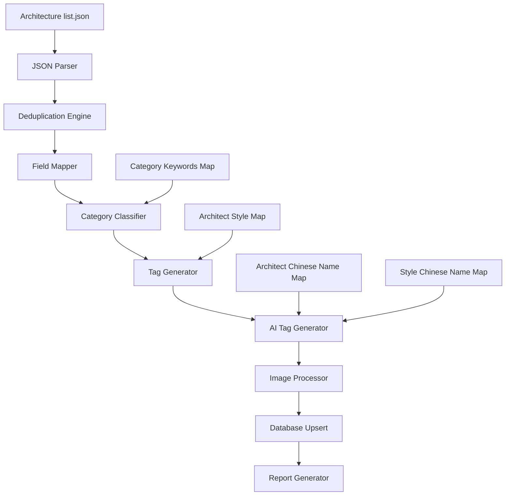

# Design Document: Pritzker Architecture Import

## Overview

本设计文档描述普利兹克奖建筑作品导入系统的技术实现方案。系统将解析 Wikidata 抓取的 JSON 数据，进行去重、字段映射、分类识别、标签生成，最终导入到 Place 数据库。

## Architecture



## Components and Interfaces

### 1. WikidataArchitectureEntry (输入数据类型)

```typescript
interface WikidataArchitectureEntry {
  architect: string;      // Wikidata URL, e.g., "http://www.wikidata.org/entity/Q134165"
  architectLabel: string; // 建筑师名称, e.g., "Oscar Niemeyer"
  work: string;           // Wikidata URL, e.g., "http://www.wikidata.org/entity/Q281521"
  workLabel: string;      // 作品名称, e.g., "Sambadrome Marquês de Sapucaí"
  image?: string;         // Wikimedia Commons URL
  coord?: string;         // "Point(lng lat)" 格式
  cityLabel?: string;     // 城市名
  countryLabel?: string;  // 国家名
}
```

### 2. DeduplicatedBuilding (去重后的中间数据)

```typescript
interface DeduplicatedBuilding {
  wikidataQID: string;           // e.g., "Q281521"
  architectQID: string;          // e.g., "Q134165"
  architectLabel: string;
  workLabel: string;
  latitude: number;
  longitude: number;
  cities: string[];              // 所有关联的城市名
  country: string;
  images: string[];              // 所有收集的图片 URL
}
```

### 3. PlaceImportData (导入到数据库的数据)

```typescript
interface PlaceImportData {
  name: string;
  city: string;
  country: string;
  latitude: number;
  longitude: number;
  coverImage: string | null;
  images: string[];
  source: "wikidata";
  sourceDetail: string;          // Wikidata QID
  isVerified: boolean;
  category: string;
  categorySlug: string;
  categoryEn: string;
  categoryZh: string;
  tags: {
    award: string[];
    style: string[];
    architect: string[];
  };
  aiTags: Array<{
    en: string;
    zh: string;
    priority: number;
  }>;
  customFields: {
    architect: string;
    architectQID: string;
    wikidataWorkURL: string;
  };
}
```

### 4. ImportReport (导入报告)

```typescript
interface ImportReport {
  timestamp: string;
  totalEntriesInJson: number;
  uniqueBuildingsAfterDedup: number;
  newRecordsCreated: number;
  existingRecordsUpdated: number;
  recordsSkipped: Array<{
    wikidataQID: string;
    reason: string;
  }>;
  recordsNeedingReview: Array<{
    wikidataQID: string;
    issue: string;
  }>;
}
```

## Data Models

### Building Style Detection (基于作品名称)

建筑风格应该跟着作品本身走，而不是建筑师。通过分析作品名称和 Wikidata 信息来推断风格：

```typescript
// 基于作品名称关键词推断风格
const WORK_STYLE_KEYWORDS: Record<string, string[]> = {
  'Brutalist': ['Brutalism'],
  'Modernist': ['Modernism'],
  'Gothic': ['Gothic'],
  'Art Deco': ['ArtDeco'],
  'Pavilion': ['Pavilion'],
  'Tensile': ['Tensile'],
  'Organic': ['Organic'],
};

// 默认风格：如果无法从作品名称推断，则不添加具体风格标签
// 只保留通用的 "Architecture" 标签
```

### AI 增强数据获取

导入后可通过 AI 服务增强数据，获取更多字段信息：

```typescript
interface AIEnrichmentRequest {
  name: string;           // 建筑作品名称
  architect: string;      // 建筑师名称
  city: string;
  country: string;
  latitude: number;
  longitude: number;
}

interface AIEnrichmentResponse {
  description?: string;      // AI 生成的建筑描述
  address?: string;          // 详细地址
  website?: string;          // 官方网站
  openingHours?: string;     // 营业时间
  architecturalStyle?: string[]; // 建筑风格（基于作品本身）
  yearBuilt?: number;        // 建造年份
  significance?: string;     // 建筑意义/特色
}
```

### 多语言支持策略

不在导入时硬编码中文翻译，而是：
1. 导入时只存储英文原始数据
2. 使用 i18n 字段存储多语言内容
3. 后续通过翻译服务或 AI 批量生成多语言版本

```typescript
interface I18nContent {
  en: {
    name: string;
    description?: string;
    tags?: string[];
  };
  zh?: {
    name: string;
    description?: string;
    tags?: string[];
  };
  // 其他语言...
}
```

### Category Classification Rules

```typescript
const CATEGORY_RULES: Array<{
  keywords: string[];
  category: string;
  categorySlug: string;
  categoryEn: string;
  categoryZh: string;
}> = [
  { keywords: ['Museum', 'Gallery', 'Art'], category: 'museum', categorySlug: 'museum', categoryEn: 'Museum', categoryZh: '博物馆' },
  { keywords: ['Church', 'Cathedral', 'Chapel', 'Basilica'], category: 'church', categorySlug: 'church', categoryEn: 'Church', categoryZh: '教堂' },
  { keywords: ['University', 'School', 'College', 'Campus', 'Institute'], category: 'university', categorySlug: 'university', categoryEn: 'University', categoryZh: '大学' },
  { keywords: ['Library'], category: 'library', categorySlug: 'library', categoryEn: 'Library', categoryZh: '图书馆' },
  { keywords: ['Stadium', 'Arena', 'Gymnasium', 'Sports'], category: 'stadium', categorySlug: 'stadium', categoryEn: 'Stadium', categoryZh: '体育场' },
  { keywords: ['Theater', 'Theatre', 'Opera', 'Concert'], category: 'theater', categorySlug: 'theater', categoryEn: 'Theater', categoryZh: '剧院' },
  { keywords: ['Hospital', 'Medical', 'Clinic'], category: 'hospital', categorySlug: 'hospital', categoryEn: 'Hospital', categoryZh: '医院' },
  { keywords: ['Station', 'Terminal', 'Airport'], category: 'station', categorySlug: 'station', categoryEn: 'Station', categoryZh: '车站' },
  { keywords: ['Pavilion'], category: 'pavilion', categorySlug: 'pavilion', categoryEn: 'Pavilion', categoryZh: '展亭' },
  { keywords: ['Tower', 'Building', 'Center', 'Centre', 'Headquarters'], category: 'building', categorySlug: 'building', categoryEn: 'Building', categoryZh: '建筑' },
];

const DEFAULT_CATEGORY = {
  category: 'architecture',
  categorySlug: 'architecture',
  categoryEn: 'Architecture',
  categoryZh: '建筑',
};
```

## Core Functions

### 1. parseCoordinates

```typescript
function parseCoordinates(coord: string): { latitude: number; longitude: number } | null {
  // Input: "Point(-43.196851 -22.911384)"
  // Output: { latitude: -22.911384, longitude: -43.196851 }
  const match = coord.match(/Point\(([-\d.]+)\s+([-\d.]+)\)/);
  if (!match) return null;
  return {
    longitude: parseFloat(match[1]),
    latitude: parseFloat(match[2]),
  };
}
```

### 2. extractWikidataQID

```typescript
function extractWikidataQID(url: string): string | null {
  // Input: "http://www.wikidata.org/entity/Q281521"
  // Output: "Q281521"
  const match = url.match(/Q\d+$/);
  return match ? match[0] : null;
}
```

### 3. formatArchitectTag

```typescript
function formatArchitectTag(architectLabel: string): string {
  // Input: "Oscar Niemeyer" → Output: "OscarNiemeyer"
  // Input: "I. M. Pei" → Output: "IMPei"
  // Input: "Kenzō Tange" → Output: "KenzoTange"
  return architectLabel
    .normalize('NFD')
    .replace(/[\u0300-\u036f]/g, '') // 移除变音符号
    .replace(/[^a-zA-Z]/g, '');       // 只保留字母
}
```

### 4. selectBestCity

```typescript
function selectBestCity(cities: string[]): string {
  // 优先选择不包含 "arrondissement", "District", "Subdistrict" 的城市名
  // 如果都包含，选择最短的
  const filtered = cities.filter(c => 
    !c.includes('arrondissement') && 
    !c.includes('District') && 
    !c.includes('Subdistrict')
  );
  if (filtered.length > 0) {
    return filtered.sort((a, b) => a.length - b.length)[0];
  }
  return cities.sort((a, b) => a.length - b.length)[0];
}
```

### 5. convertWikimediaUrl

```typescript
function convertWikimediaUrl(url: string): string {
  // Input: "http://commons.wikimedia.org/wiki/Special:FilePath/Image%20Name.jpg"
  // Output: "https://commons.wikimedia.org/wiki/Special:FilePath/Image%20Name.jpg"
  return url.replace('http://', 'https://');
}
```

### 6. enrichBuildingWithAI (AI 增强)

```typescript
async function enrichBuildingWithAI(building: DeduplicatedBuilding): Promise<AIEnrichmentResponse> {
  // 使用 OpenAI 联网搜索获取更多信息
  const prompt = `
    请搜索以下建筑作品的详细信息：
    - 作品名称: ${building.workLabel}
    - 建筑师: ${building.architectLabel}
    - 城市: ${building.cities[0]}
    - 国家: ${building.country}
    
    请提供以下信息（如果能找到）：
    1. 建筑描述（100-200字，介绍建筑特色和意义）
    2. 详细地址
    3. 官方网站
    4. 开放时间（如果是公共建筑）
    5. 建筑风格（基于这个具体作品，不是建筑师的一般风格）
    6. 建造年份
    
    以 JSON 格式返回。
  `;
  
  // 调用 OpenAI API with web search
  const response = await openai.chat.completions.create({
    model: 'gpt-4o',
    messages: [{ role: 'user', content: prompt }],
    // 启用联网搜索（如果可用）
  });
  
  return parseAIResponse(response);
}
```

### 7. fetchWikidataDetails (Wikidata API 增强)

```typescript
async function fetchWikidataDetails(qid: string): Promise<WikidataDetails | null> {
  // 从 Wikidata API 获取更多属性
  const url = `https://www.wikidata.org/wiki/Special:EntityData/${qid}.json`;
  const response = await fetch(url);
  const data = await response.json();
  
  const entity = data.entities[qid];
  if (!entity) return null;
  
  return {
    // P571 - 成立或创建时间
    yearBuilt: extractYear(entity.claims?.P571),
    // P149 - 建筑风格
    architecturalStyle: extractStyles(entity.claims?.P149),
    // P856 - 官方网站
    website: extractUrl(entity.claims?.P856),
    // P6375 - 街道地址
    address: extractAddress(entity.claims?.P6375),
    // P373 - Commons 分类
    commonsCategory: extractString(entity.claims?.P373),
  };
}
```


## Correctness Properties

*A property is a characteristic or behavior that should hold true across all valid executions of a system—essentially, a formal statement about what the system should do. Properties serve as the bridge between human-readable specifications and machine-verifiable correctness guarantees.*

### Property 1: Coordinate Parsing Round Trip

*For any* valid coordinate string in "Point(lng lat)" format, parsing it should produce a latitude and longitude pair where the values match the original input numbers.

**Validates: Requirements 1.2**

### Property 2: Wikidata QID Extraction

*For any* valid Wikidata URL containing a QID (e.g., "http://www.wikidata.org/entity/Q123456"), extracting the QID should return the exact Q-number from the URL.

**Validates: Requirements 1.3**

### Property 3: Deduplication by QID

*For any* set of JSON entries where multiple entries share the same Wikidata QID, the deduplication process should produce exactly one building record per unique QID.

**Validates: Requirements 2.1, 2.2**

### Property 4: City Selection Preference

*For any* set of city names associated with a building, the selected city should not contain "arrondissement", "District", or "Subdistrict" if a cleaner alternative exists.

**Validates: Requirements 2.2**

### Property 5: Architect Tag Formatting

*For any* architect name string, the formatted tag should contain only ASCII letters (no spaces, dots, accents, or special characters).

**Validates: Requirements 5.2**

### Property 6: Tag Structure Completeness

*For any* imported building, the tags object should contain exactly three keys: "award", "style", and "architect", where "award" always contains "Pritzker" and "style" always contains "Architecture".

**Validates: Requirements 5.1, 5.4**

### Property 7: AI Tags Priority Ordering

*For any* imported building, the aiTags array should be sorted by priority in descending order, with award tags (priority 100) first, architect tags (priority 90) second, specific style tags (priority 80) third, and generic tags (priority 50) last.

**Validates: Requirements 6.1, 6.2**

### Property 8: Image URL HTTPS Conversion

*For any* Wikimedia Commons URL starting with "http://", the converted URL should start with "https://" while preserving the rest of the path.

**Validates: Requirements 7.1**

### Property 9: Image Collection Uniqueness

*For any* set of duplicate entries for the same building, the merged images array should contain only unique URLs with no duplicates.

**Validates: Requirements 7.3**

### Property 10: Category Classification Consistency

*For any* work label containing a category keyword (e.g., "Museum", "Church"), the assigned category should match the expected category for that keyword.

**Validates: Requirements 4.1**

### Property 11: Report Counts Accuracy

*For any* import operation, the sum of (new records created + existing records updated + records skipped) should equal the number of unique buildings after deduplication.

**Validates: Requirements 2.4, 8.1**

## Error Handling

### Invalid JSON Entry Handling

```typescript
interface ValidationResult {
  isValid: boolean;
  errors: string[];
}

function validateEntry(entry: WikidataArchitectureEntry): ValidationResult {
  const errors: string[] = [];
  
  if (!entry.work) errors.push('Missing work URL');
  if (!entry.workLabel) errors.push('Missing work label');
  if (!entry.architectLabel) errors.push('Missing architect label');
  if (entry.coord && !parseCoordinates(entry.coord)) {
    errors.push('Invalid coordinate format');
  }
  
  return {
    isValid: errors.length === 0,
    errors,
  };
}
```

### Missing Coordinate Handling

- 如果 coord 字段缺失或无法解析，记录将被标记为需要手动审核
- 不会阻止导入，但会在报告中列出

### Q-Number Work Label Handling

- 如果 workLabel 是 Q 开头的数字（如 Q118424126），表示 Wikidata 没有该实体的标签
- 这些记录将被标记为需要手动审核，需要人工补充名称

### Database Upsert Error Handling

```typescript
async function upsertPlace(data: PlaceImportData): Promise<UpsertResult> {
  try {
    const existing = await prisma.place.findFirst({
      where: {
        OR: [
          { sourceDetail: data.sourceDetail },
          { googlePlaceId: data.sourceDetail }, // 兼容旧数据
        ],
      },
    });
    
    if (existing) {
      await prisma.place.update({
        where: { id: existing.id },
        data: { ...data, updatedAt: new Date() },
      });
      return { action: 'updated', id: existing.id };
    } else {
      const created = await prisma.place.create({ data });
      return { action: 'created', id: created.id };
    }
  } catch (error) {
    return { action: 'error', error: error.message };
  }
}
```

## Testing Strategy

### Unit Tests

单元测试用于验证各个独立函数的正确性：

1. **parseCoordinates** - 测试各种坐标格式的解析
2. **extractWikidataQID** - 测试 QID 提取
3. **formatArchitectTag** - 测试建筑师标签格式化
4. **selectBestCity** - 测试城市选择逻辑
5. **convertWikimediaUrl** - 测试 URL 转换
6. **classifyCategory** - 测试分类识别

### Property-Based Tests

使用 fast-check 库进行属性测试，每个测试运行至少 100 次迭代：

```typescript
import * as fc from 'fast-check';

// Property 1: Coordinate Parsing
// Feature: pritzker-architecture-import, Property 1: Coordinate Parsing Round Trip
fc.assert(
  fc.property(
    fc.float({ min: -180, max: 180 }),
    fc.float({ min: -90, max: 90 }),
    (lng, lat) => {
      const coordStr = `Point(${lng} ${lat})`;
      const result = parseCoordinates(coordStr);
      return result !== null && 
             Math.abs(result.longitude - lng) < 0.0001 &&
             Math.abs(result.latitude - lat) < 0.0001;
    }
  ),
  { numRuns: 100 }
);

// Property 5: Architect Tag Formatting
// Feature: pritzker-architecture-import, Property 5: Architect Tag Formatting
fc.assert(
  fc.property(
    fc.string(),
    (name) => {
      const tag = formatArchitectTag(name);
      return /^[a-zA-Z]*$/.test(tag);
    }
  ),
  { numRuns: 100 }
);
```

### Integration Tests

集成测试验证完整的导入流程：

1. **End-to-end import** - 使用测试 JSON 文件进行完整导入
2. **Deduplication verification** - 验证重复条目被正确合并
3. **Database state verification** - 验证数据库中的记录符合预期

### Test Data

创建测试用的 JSON 文件，包含：
- 正常条目
- 重复条目（相同 QID，不同城市）
- 缺失字段的条目
- Q-number 作为名称的条目
- 各种分类关键词的条目
