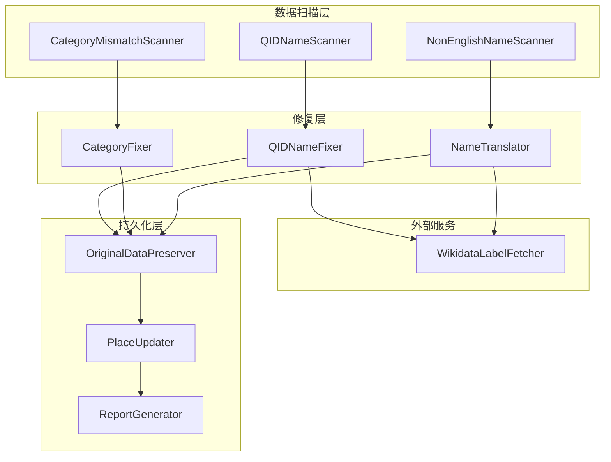

# Design Document: Wikidata Data Quality Fix

## Overview

本设计文档描述了修复 Wikidata 导入数据质量问题的系统架构。系统需要处理三类问题：QID 名称修复、分类重新检测、名称英文化。复用现有的 wikidataImportUtils.ts 中的工具函数，并新增数据修复专用的组件。

## Architecture



## Components and Interfaces

### 1. QIDNameScanner

检测名称为 QID 格式的记录。

```typescript
/**
 * Check if a name is a QID (Q followed by digits only)
 * @param name - Place name to check
 * @returns true if name matches QID pattern
 */
function isQIDName(name: string): boolean;

/**
 * Scan database for places with QID names
 * @returns Array of places with QID as name
 */
async function scanQIDNames(): Promise<PlaceRecord[]>;
```

### 2. CategoryDetector

从名称关键词检测正确分类。

```typescript
interface CategoryKeywords {
  slug: string;
  patterns: RegExp[];
}

/**
 * Detect category from place name using keyword patterns
 * @param name - Place name
 * @returns Detected category slug, or null if no match
 */
function detectCategoryFromKeywords(name: string): string | null;

/**
 * Get category display names from slug
 * @param slug - Category slug
 * @returns Category info with en and zh names
 */
function getCategoryNames(slug: string): { en: string; zh: string };
```

### 3. NonEnglishNameDetector

检测非英文名称。

```typescript
/**
 * Check if a name contains non-ASCII characters
 * @param name - Place name to check
 * @returns true if name contains non-ASCII characters
 */
function hasNonAsciiCharacters(name: string): boolean;

/**
 * Scan database for places with non-English names
 * @returns Array of places with non-ASCII names
 */
async function scanNonEnglishNames(): Promise<PlaceRecord[]>;
```

### 4. WikidataLabelFetcher

从 Wikidata API 获取实体标签。

```typescript
interface WikidataLabels {
  en?: string;           // English label
  [lang: string]: string | undefined;  // Other language labels
}

/**
 * Fetch labels for a Wikidata entity
 * @param qid - Wikidata QID (e.g., "Q12345")
 * @returns Labels in various languages
 */
async function fetchLabels(qid: string): Promise<WikidataLabels>;

/**
 * Select best label with English priority
 * @param labels - Available labels
 * @returns Best label (English preferred, then Latin-script)
 */
function selectBestLabel(labels: WikidataLabels): string | null;
```

### 5. OriginalDataPreserver

保存原始数据到 customFields。

```typescript
interface PreservationResult {
  originalName?: string;
  originalCategory?: string;
  lastFixedAt: string;
  fixType: string[];
}

/**
 * Preserve original data before modification
 * @param place - Current place record
 * @param fixType - Type of fix being applied
 * @returns Updated customFields with preserved data
 */
function preserveOriginalData(
  place: PlaceRecord,
  fixType: 'qid_name' | 'category' | 'translation'
): Record<string, unknown>;
```

### 6. PlaceUpdater

批量更新数据库记录。

```typescript
interface UpdateResult {
  success: number;
  failed: number;
  errors: Array<{ id: string; error: string }>;
}

/**
 * Update places in batches
 * @param updates - Array of place updates
 * @param dryRun - If true, don't actually update
 * @returns Update result statistics
 */
async function updatePlaces(
  updates: PlaceUpdate[],
  dryRun: boolean
): Promise<UpdateResult>;
```

## Data Models

### PlaceRecord (Input)

```typescript
interface PlaceRecord {
  id: string;
  name: string;
  categorySlug: string | null;
  categoryEn: string | null;
  categoryZh: string | null;
  sourceDetail: string | null;  // QID
  customFields: Record<string, unknown> | null;
}
```

### PlaceUpdate (Output)

```typescript
interface PlaceUpdate {
  id: string;
  name?: string;
  categorySlug?: string;
  categoryEn?: string;
  categoryZh?: string;
  customFields: Record<string, unknown>;
}
```

### FixReport

```typescript
interface FixReport {
  totalScanned: number;
  qidNamesFixed: number;
  categoriesChanged: number;
  namesTranslated: number;
  errors: number;
  details: {
    qidFixes: Array<{ id: string; oldName: string; newName: string }>;
    categoryFixes: Array<{ id: string; name: string; oldCategory: string; newCategory: string }>;
    translationFixes: Array<{ id: string; oldName: string; newName: string }>;
    errorList: Array<{ id: string; error: string }>;
  };
}
```

## Correctness Properties

*A property is a characteristic or behavior that should hold true across all valid executions of a system—essentially, a formal statement about what the system should do. Properties serve as the bridge between human-readable specifications and machine-verifiable correctness guarantees.*

### Property 1: QID Name Detection

*For any* string, the QID name detector should return true if and only if the string matches the pattern "Q" followed by one or more digits with no other characters.

**Validates: Requirements 1.1**

### Property 2: Category Detection from Name Keywords

*For any* place name containing category-specific keywords (museum, hotel, church, castle, library, university, temple, cafe), the category detector should return the corresponding category slug. The detection should be case-insensitive and support multiple languages (English, French, German, Italian, Spanish, Japanese).

**Validates: Requirements 2.2, 2.3, 2.4, 2.5, 2.6, 2.7, 2.8**

### Property 3: Non-ASCII Name Detection

*For any* string, the non-ASCII detector should return true if and only if the string contains at least one character outside the ASCII range (0x00-0x7F).

**Validates: Requirements 3.1**

### Property 4: Label Selection Priority

*For any* set of Wikidata labels, the label selector should return the English label if available. If no English label exists, it should return a label in a Latin-script language (French, German, Spanish, Italian, Portuguese, Dutch). If no Latin-script label exists, it should return the first available label.

**Validates: Requirements 1.4, 3.6**

### Property 5: Original Data Preservation Invariant

*For any* place update operation, if the place's name or category is being changed, the original value must be stored in customFields before the update. Specifically:
- If name is changing and customFields.originalName doesn't exist, it must be set to the old name
- If category is changing and customFields.originalCategory doesn't exist, it must be set to the old category

**Validates: Requirements 6.1, 6.2**

### Property 6: Fix Type Recording

*For any* place update operation, the customFields.fixType array must contain exactly the types of fixes applied. If a QID name was fixed, "qid_name" must be in the array. If category was changed, "category" must be in the array. If name was translated, "translation" must be in the array.

**Validates: Requirements 6.4**

### Property 7: Category Fields Consistency

*For any* category update, all three category fields (categorySlug, categoryEn, categoryZh) must be updated together and must be consistent with each other according to the category mapping.

**Validates: Requirements 2.9**

## Error Handling

### Wikidata API Errors
- Use existing RetryHandler with exponential backoff (1s, 2s, 4s)
- After 3 retries, skip the record and log error
- Continue processing remaining records

### Database Errors
- Log error with place ID and details
- Continue processing remaining records
- Include failed records in final report

### Invalid Data
- Skip records with missing sourceDetail (QID) for API-dependent operations
- Log skipped records with reason
- Include in final statistics

## Testing Strategy

### Unit Tests
- QID name pattern matching
- Category keyword detection
- Non-ASCII character detection
- Label selection logic

### Property-Based Tests
Using fast-check library for TypeScript:

1. **QID Detection**: Generate random strings, verify pattern matching
2. **Category Detection**: Generate names with keywords, verify correct categories
3. **Non-ASCII Detection**: Generate strings with various character sets
4. **Label Selection**: Generate label sets, verify priority order
5. **Data Preservation**: Verify original data is preserved before updates
6. **Fix Type Recording**: Verify correct fix types are recorded

### Integration Tests
- End-to-end fix with sample data
- Database state verification after fixes
- Report generation verification

### Test Configuration
- Minimum 100 iterations per property test
- Mock Wikidata API for deterministic testing
- Use test database for integration tests
