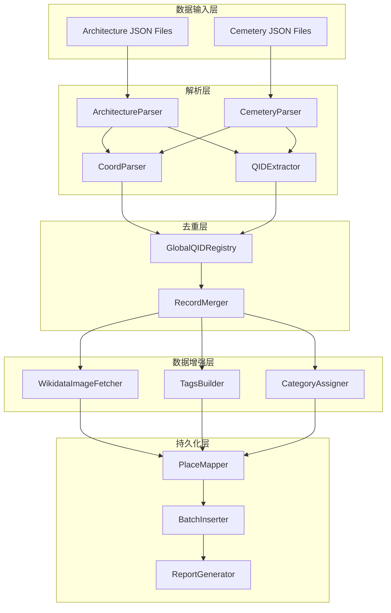

# Design Document: Wikidata Import

## Overview

本设计文档描述了从 Wikidata 导入建筑和墓地数据到 WanderLog 数据库的系统架构。系统需要处理两类数据源（建筑和墓地），实现全局 QID 去重，从 Wikidata API 获取图片，并确保所有数据完整落库。

## Architecture



## Components and Interfaces

### 1. CoordParser

解析 Wikidata 坐标格式。

```typescript
interface Coordinates {
  latitude: number;
  longitude: number;
}

function parseCoord(coordString: string): Coordinates | null;
// Input: "Point(2.294479 48.858296)"
// Output: { latitude: 48.858296, longitude: 2.294479 }
```

### 2. QIDExtractor

从 Wikidata URL 提取实体 ID。

```typescript
function extractQID(wikidataUrl: string): string | null;
// Input: "http://www.wikidata.org/entity/Q243"
// Output: "Q243"
```

### 3. ArchitectureParser

解析建筑 JSON 数据。

```typescript
interface ArchitectureEntry {
  work: string;           // Wikidata URL
  workLabel: string;      // 建筑名称
  architect?: string;     // 建筑师 Wikidata URL
  architectLabel?: string;
  style?: string;         // 风格 Wikidata URL
  styleLabel?: string;
  coord: string;          // "Point(lng lat)"
  image?: string;         // Commons 图片 URL
  sitelinks?: string;     // 站点链接数
  countryLabel?: string;
  cityLabel?: string;
}

interface ParsedArchitecture {
  qid: string;
  name: string;
  coordinates: Coordinates;
  architects: string[];
  styles: string[];
  images: string[];
  country?: string;
  city?: string;
  sitelinks?: number;
  sourceUrls: {
    work: string;
    architects: string[];
    styles: string[];
  };
}

function parseArchitectureEntry(entry: ArchitectureEntry): ParsedArchitecture;
```

### 4. CemeteryParser

解析墓地 JSON 数据。

```typescript
interface CemeteryEntry {
  cemetery: string;       // Wikidata URL
  cemeteryLabel: string;  // 墓地名称
  coord: string;
  countryLabel?: string;
  cityLabel?: string;
  image?: string;
  cemSitelinks?: string;
  celebsCount?: string;
  artistCount?: string;
  writerCount?: string;
  musicCount?: string;
  scientistCount?: string;
}

interface ParsedCemetery {
  qid: string;
  name: string;
  coordinates: Coordinates;
  images: string[];
  country?: string;
  city?: string;
  sitelinks?: number;
  celebrityCounts: {
    total?: number;
    artist?: number;
    writer?: number;
    musician?: number;
    scientist?: number;
  };
  sourceUrls: {
    cemetery: string;
  };
}

function parseCemeteryEntry(entry: CemeteryEntry): ParsedCemetery;
```

### 5. GlobalQIDRegistry

全局 QID 去重注册表。

```typescript
interface MergedRecord {
  qid: string;
  name: string;
  coordinates: Coordinates;
  architects: string[];    // 合并后的建筑师列表
  styles: string[];        // 合并后的风格列表
  images: string[];        // 合并后的图片列表
  country?: string;
  city?: string;
  sitelinks?: number;
  celebrityCounts?: CelebrityCounts;
  sourceUrls: Record<string, string[]>;
  dataType: 'architecture' | 'cemetery';
  sourceFile: string;      // 来源文件名，用于判断是否添加 style tag
}

class GlobalQIDRegistry {
  private processedQIDs: Map<string, MergedRecord>;
  
  register(record: ParsedArchitecture | ParsedCemetery, sourceFile: string): boolean;
  merge(existing: MergedRecord, newRecord: ParsedArchitecture | ParsedCemetery): MergedRecord;
  getAll(): MergedRecord[];
  getStats(): { total: number; duplicates: number };
}
```

### 6. WikidataImageFetcher

从 Wikidata API 获取图片。

```typescript
interface WikidataImages {
  coverImage: string | null;
  additionalImages: string[];
}

class WikidataImageFetcher {
  private rateLimiter: RateLimiter;
  
  async fetchImages(qid: string, existingImages: string[]): Promise<WikidataImages>;
  private async fetchFromWikidataAPI(qid: string): Promise<string[]>;
  private filterBannerImages(images: string[]): string[];
}
```

### 7. TagsBuilder

构建 tags JSON 对象。

```typescript
interface PlaceTags {
  style?: string[];
  architect?: string[];
  theme?: string[];
}

class TagsBuilder {
  buildArchitectureTags(record: MergedRecord): PlaceTags;
  buildCemeteryTags(record: MergedRecord): PlaceTags;
  
  private shouldAddStyleTag(sourceFile: string): boolean;
  private buildThemeTags(counts: CelebrityCounts): string[];
}
```

### 8. CategoryAssigner

分配分类信息。

```typescript
interface CategoryInfo {
  categorySlug: string;
  categoryEn: string;
  categoryZh?: string;
}

function assignCategory(dataType: 'architecture' | 'cemetery'): CategoryInfo;
```

### 9. PlaceMapper

映射到数据库 Place 模型。

```typescript
interface PlaceImportData {
  name: string;
  city?: string;
  country?: string;
  latitude: number;
  longitude: number;
  categorySlug: string;
  categoryEn: string;
  tags: PlaceTags;
  coverImage?: string;
  images: string[];
  source: string;
  sourceDetail: string;
  isVerified: boolean;
  customFields: Record<string, any>;
}

function mapToPlaceData(record: MergedRecord, images: WikidataImages, tags: PlaceTags): PlaceImportData;
```

### 10. BatchInserter

批量数据库插入。

```typescript
interface InsertResult {
  success: number;
  failed: number;
  errors: Array<{ qid: string; error: string }>;
}

class BatchInserter {
  private batchSize: number = 50;
  
  async insertBatch(places: PlaceImportData[]): Promise<InsertResult>;
  async upsertPlace(place: PlaceImportData): Promise<'created' | 'updated' | 'error'>;
}
```

## Data Models

### Input JSON Structures

**Architecture (Top/Style files)**:
```json
{
  "work": "http://www.wikidata.org/entity/Q243",
  "workLabel": "Eiffel Tower",
  "architect": "http://www.wikidata.org/entity/Q778243",
  "architectLabel": "Stéphen Sauvestre",
  "style": "http://www.wikidata.org/entity/Q994776",
  "styleLabel": "brutalist architecture",
  "coord": "Point(2.294479 48.858296)",
  "image": "http://commons.wikimedia.org/wiki/Special:FilePath/Tour%20Eiffel.jpg",
  "sitelinks": "186",
  "countryLabel": "France",
  "cityLabel": "Paris"
}
```

**Cemetery (with celebrity counts)**:
```json
{
  "cemetery": "http://www.wikidata.org/entity/Q311",
  "cemeteryLabel": "Père Lachaise Cemetery",
  "coord": "Point(2.394166666 48.861111111)",
  "countryLabel": "France",
  "cityLabel": "20th arrondissement of Paris",
  "image": "http://commons.wikimedia.org/wiki/Special:FilePath/Pere-Lachaise.jpg",
  "cemSitelinks": "70",
  "celebsCount": "1028",
  "artistCount": "224",
  "writerCount": "293",
  "musicCount": "110",
  "scientistCount": "49"
}
```

### Output Place Structure

```typescript
{
  id: "uuid",
  name: "Eiffel Tower",
  city: "Paris",
  country: "France",
  latitude: 48.858296,
  longitude: 2.294479,
  categorySlug: "architecture",
  categoryEn: "Architecture",
  tags: {
    style: ["Brutalist"],
    architect: ["Stéphen Sauvestre"]
  },
  coverImage: "https://...",
  images: ["https://...", "https://..."],
  source: "wikidata",
  sourceDetail: "Q243",
  isVerified: true,
  customFields: {
    sitelinks: 186,
    wikidataUrls: {
      work: "http://www.wikidata.org/entity/Q243",
      architects: ["http://www.wikidata.org/entity/Q778243"],
      styles: ["http://www.wikidata.org/entity/Q994776"]
    }
  }
}
```

## Correctness Properties

*A property is a characteristic or behavior that should hold true across all valid executions of a system—essentially, a formal statement about what the system should do. Properties serve as the bridge between human-readable specifications and machine-verifiable correctness guarantees.*

### Property 1: Coordinate Parsing Round-Trip

*For any* valid coordinate string in format "Point(longitude latitude)", parsing and then formatting back should produce an equivalent coordinate string.

**Validates: Requirements 1.3, 7.4, 7.5**

### Property 2: QID Extraction Correctness

*For any* valid Wikidata URL containing an entity ID, extracting the QID should return the correct Q-number, and for any invalid URL, extraction should return null.

**Validates: Requirements 1.4**

### Property 3: Global Deduplication Invariant

*For any* set of input records, after processing through GlobalQIDRegistry, the number of unique QIDs in output should equal the number of distinct QIDs in input, and no QID should appear more than once.

**Validates: Requirements 2.1, 2.2**

### Property 4: Record Merging Completeness

*For any* set of records with the same QID but different architects/styles, merging should produce a record containing all unique architects and all unique styles from the input records.

**Validates: Requirements 2.3**

### Property 5: Category Assignment Correctness

*For any* architecture record, category_slug should be "architecture" and category_en should be "Architecture". *For any* cemetery record, category_slug should be "cemetery" and category_en should be "Cemetery".

**Validates: Requirements 3.1, 4.1**

### Property 6: Style Tag Conditional Assignment

*For any* architecture record from a style-named file (not architecture1.json or architecture2.json), the tags.style array should contain the styleLabel value. *For any* architecture record from architecture1.json or architecture2.json, tags.style should not be populated from the file.

**Validates: Requirements 3.2, 3.3**

### Property 7: Cemetery Theme Tag Generation

*For any* cemetery record with specific count fields > 0, the corresponding theme should be present in tags.theme. Specifically:
- artistCount > 0 → "artist" in theme
- scientistCount > 0 → "scientist" in theme  
- musicCount > 0 → "musician" in theme
- writerCount > 0 → "writer" in theme
- celebsCount > 0 with no specific counts → "celebrity" in theme

**Validates: Requirements 4.2, 4.3, 4.4, 4.5, 4.6**

### Property 8: Image Collection Preservation

*For any* record with existing images from JSON, after processing, the images array should contain all original images plus any new images from Wikidata API (excluding banners).

**Validates: Requirements 5.3, 5.4**

### Property 9: Cover Image Selection

*For any* record with at least one image, cover_image should be set to the first image. If Wikidata API returns no images but JSON has an image, that image should be cover_image.

**Validates: Requirements 5.2, 5.5**

### Property 10: Source Metadata Completeness

*For any* imported place, source should be "wikidata", source_detail should be the QID, and is_verified should be true.

**Validates: Requirements 6.1, 6.2, 6.5**

### Property 11: Custom Fields Preservation

*For any* imported place, custom_fields should contain all unmapped data including sitelinks count and all original Wikidata URLs.

**Validates: Requirements 6.3, 6.4**

### Property 12: Field Mapping Correctness

*For any* architecture record, name should equal workLabel. *For any* cemetery record, name should equal cemeteryLabel. City and country should be mapped from cityLabel and countryLabel respectively.

**Validates: Requirements 7.1, 7.2, 7.3**

### Property 13: Retry Behavior on API Failure

*For any* Wikidata API call that fails, the system should retry up to 3 times with exponential backoff before giving up.

**Validates: Requirements 8.2**

### Property 14: Batch Processing Size

*For any* import operation, database inserts should be performed in batches of at most 50 records.

**Validates: Requirements 9.1**

## Error Handling

### JSON Parsing Errors
- Log error with file path and continue processing other files
- Include failed file in final report

### Wikidata API Errors
- Implement retry with exponential backoff (1s, 2s, 4s)
- After 3 retries, use fallback images from JSON
- Log API errors for monitoring

### Database Errors
- Log error with place details (QID, name)
- Continue processing remaining records
- Include failed records in final report

### Invalid Data
- Skip records with missing required fields (QID, name, coordinates)
- Log skipped records with reason
- Include in final statistics

## Testing Strategy

### Unit Tests
- CoordParser: Test various coordinate formats, edge cases
- QIDExtractor: Test valid URLs, invalid URLs, edge cases
- TagsBuilder: Test theme generation logic
- CategoryAssigner: Test both data types

### Property-Based Tests
Using fast-check library for TypeScript:

1. **Coordinate parsing**: Generate random valid coordinates, verify round-trip
2. **QID extraction**: Generate random Q-numbers, construct URLs, verify extraction
3. **Deduplication**: Generate records with duplicate QIDs, verify uniqueness
4. **Merging**: Generate records with overlapping data, verify completeness
5. **Category assignment**: Generate random data types, verify correct categories
6. **Theme generation**: Generate random celebrity counts, verify correct themes

### Integration Tests
- End-to-end import with sample JSON files
- Database state verification after import
- Report generation verification

### Test Configuration
- Minimum 100 iterations per property test
- Mock Wikidata API for deterministic testing
- Use test database for integration tests
