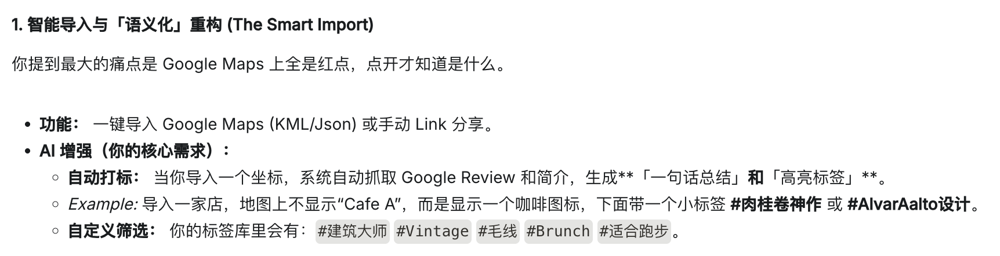

# PRD

# **Introduction**

这是一个城市漫游记录产品。支持导入自己的 Google map 点位，也支持搜索全站某个城市的点位，加入自己的 wishlist 里。加入自己的列表后支持自行管理，可以设置优先级（mustgo）、加入临时计划（today’s plan），去过某个景点后在地图上置灰展示，自行手动记录日期、评分、书写感受、上传照片，形成自己的旅行记忆，方便后续回顾，后续二期也将支持分享，会有不同的模板供参考。加入 mustgo 和计划后会高亮营业时间，进行即时提醒。

每个地点有丰富个性化的标签，比如博物馆也可以是#建筑作品，面包店的特色会是#肉桂卷，方便挖掘每个地点的特色。

也支持拍照识别功能，对你感兴趣的地方进行解释和解读。

该产品一共设置两个档位的会员机制，暂定为 $12.9/月、$19.9/月，通过城市数量、地点数量、其他功能区分权益。

由于数据库暂时有限，欢迎所有用户共创，提供有趣的地点给我们。

# **🚩 Core Goals**

### **1. 高效便捷寻找 spots**

> 小红书：海量翻阅，重复性高，小众靠捞针 
Google Map：有线索后搜索，过于结构化，无差异化标签，找不到“好建筑”类似内容
> 
- spots 数据库搭建
    - 前期：个人数据
    - 有用户后：大家导入的数据持续共建
- 数据库管理
    - 分类：spots 分类，地图增加图标 highlight
    - 标签体系：人工 & AI 化
        - 人工：by me 梳理不同类别
        - AI：Google map 评论内容摘取，标签差异化
            - 推荐菜名：肉桂卷 / 手冲 / xx brunch 名
            - vibe：氛围热闹 / 安静 / 设计好 / 出片
            - 其他：本地人多original / Aalto
    - 基础信息
        - 名称、经纬度、图片（Instagram / fliker / UNsplash / pinterest 风）、营业时间、地点、电话等
        - AI 一句话总结特色

### **2. 自行管理 spots by city**

> 小红书：帖子收藏夹，无地图，无标签，需要手动在地图标记 
Google Map：标记后没有分类，出门要确定去哪里的时候对陌生城市大海捞针逐一点击，效率低（判断因素多：是否去过, 是否是“面包店”, 是否时间 ok, 是否顺路等）
> 
- 选择 spots
    - 自行导入
    - 通过标签选择自己想去的 - 地图可视化，支持按标签筛选
- 管理 spots
    - 优先级：必去，可去可不去，没想好 .etc
    - 日程管理
        - wishlist
        - Today’s Plan
            - 打烊时间提醒（来不及去了maybe）
            - 景点信息：接入 Google Popular Times 数据，“Busy” or not
            - 晚上引导 check
        - visited
    - 信息管理
        - 评分
        - 感受记录
            - 到达指定定位后引导 check - in
            - 引导书写 comment & 传图（语音转文字）

# **👧🏻 Core Persona**

- P 人，不喜欢被小时级别的 route planner 束缚
- solotrip：灵活，自己愿意 wander
- 有一定主观能动性，知道自己喜欢什么
- 戒断反应人士，后续愿意回顾、整理甚至分享自己的行程

# 📅 Roadmap & Feature List

[Phase 1](PRD/Phase%201%202c49ef41e0be80b98480ee52030b5624.csv)

[Phase2](PRD/Phase2%202c49ef41e0be80559653f29267439196.csv)

