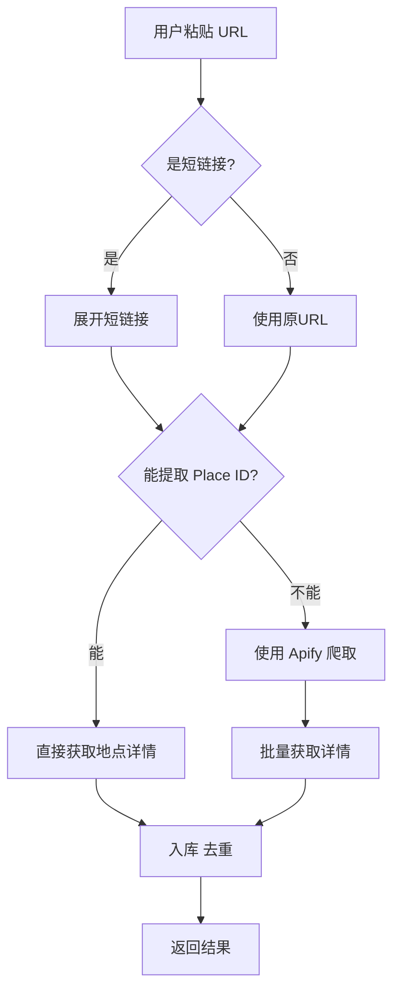

# 🚀 自动化导入 Google Maps 地点 - 快速开始

> **核心功能**: 用户粘贴 Google Maps URL → 系统自动导入地点

## ✨ 特性

- ✅ **自动展开短链接** - 支持 `goo.gl` 和 `maps.app.goo.gl`
- ✅ **智能提取 Place ID** - 多种格式自动识别
- ✅ **批量导入** - 一次导入多个地点
- ✅ **自动去重** - 基于 Place ID 自动去重
- ✅ **详细反馈** - 清晰的成功/失败统计

---

## 🎯 使用方法

### 方法 1: API 端点（推荐给客户端）

#### 启动 API 服务

```bash
cd wanderlog_api
npm run dev
```

#### 调用导入 API

```bash
curl -X POST http://localhost:3000/api/public-places/import-from-link \
  -H "Content-Type: application/json" \
  -d '{"url": "https://maps.app.goo.gl/Cd5DMwwW89C2jDbU9"}'
```

#### 响应示例

```json
{
  "success": true,
  "data": {
    "success": 1,
    "failed": 0,
    "errors": []
  },
  "message": "Successfully imported 1 new places"
}
```

---

### 方法 2: 测试脚本

```bash
cd wanderlog_api
http_proxy=http://127.0.0.1:7890 https_proxy=http://127.0.0.1:7890 \
  npx tsx test_auto_import.ts
```

---

### 方法 3: Bash 演示脚本

```bash
./demo_auto_import.sh
```

---

## 📱 客户端集成

### Flutter 示例

```dart
import 'package:dio/dio.dart';

class GoogleMapsImportService {
  final Dio _dio;

  GoogleMapsImportService(this._dio);

  /// 从 Google Maps URL 导入地点
  /// 
  /// 支持的URL格式:
  /// - 短链接: https://maps.app.goo.gl/xxxxx
  /// - 完整链接: https://www.google.com/maps/place/...
  /// - 列表链接: https://www.google.com/maps/@/data=...
  Future<ImportResult> importFromGoogleMaps(String url) async {
    try {
      final response = await _dio.post(
        '/api/public-places/import-from-link',
        data: {'url': url},
      );

      if (response.data['success']) {
        final data = response.data['data'];
        return ImportResult(
          success: data['success'],
          failed: data['failed'],
          errors: List<String>.from(data['errors'] ?? []),
        );
      } else {
        throw Exception(response.data['error']);
      }
    } catch (e) {
      throw Exception('导入失败: $e');
    }
  }
}

class ImportResult {
  final int success;
  final int failed;
  final List<String> errors;

  ImportResult({
    required this.success,
    required this.failed,
    required this.errors,
  });
}
```

### UI 组件示例

```dart
class GoogleMapsImportWidget extends StatefulWidget {
  @override
  _GoogleMapsImportWidgetState createState() => _GoogleMapsImportWidgetState();
}

class _GoogleMapsImportWidgetState extends State<GoogleMapsImportWidget> {
  final _controller = TextEditingController();
  bool _loading = false;

  Future<void> _importPlace() async {
    final url = _controller.text.trim();
    
    if (url.isEmpty) {
      ScaffoldMessenger.of(context).showSnackBar(
        SnackBar(content: Text('请输入 Google Maps 链接')),
      );
      return;
    }

    setState(() => _loading = true);

    try {
      final service = context.read<GoogleMapsImportService>();
      final result = await service.importFromGoogleMaps(url);

      ScaffoldMessenger.of(context).showSnackBar(
        SnackBar(
          content: Text('✅ 成功导入 ${result.success} 个地点'),
          backgroundColor: Colors.green,
        ),
      );

      _controller.clear();
    } catch (e) {
      ScaffoldMessenger.of(context).showSnackBar(
        SnackBar(
          content: Text('❌ 导入失败: $e'),
          backgroundColor: Colors.red,
        ),
      );
    } finally {
      setState(() => _loading = false);
    }
  }

  @override
  Widget build(BuildContext context) {
    return Card(
      child: Padding(
        padding: EdgeInsets.all(16),
        child: Column(
          crossAxisAlignment: CrossAxisAlignment.stretch,
          children: [
            Text(
              '从 Google Maps 导入',
              style: Theme.of(context).textTheme.titleLarge,
            ),
            SizedBox(height: 16),
            TextField(
              controller: _controller,
              decoration: InputDecoration(
                hintText: '粘贴 Google Maps 链接',
                prefixIcon: Icon(Icons.link),
                border: OutlineInputBorder(),
              ),
            ),
            SizedBox(height: 16),
            ElevatedButton(
              onPressed: _loading ? null : _importPlace,
              child: _loading
                  ? CircularProgressIndicator()
                  : Text('导入地点'),
            ),
          ],
        ),
      ),
    );
  }
}
```

---

## 🔍 支持的 URL 格式

### 1. 短链接 ✅
```
https://maps.app.goo.gl/Cd5DMwwW89C2jDbU9
https://goo.gl/maps/xxxxx
```

**处理流程:**
1. 自动展开为完整 URL
2. 提取 Place ID 或列表信息
3. 导入地点

### 2. 单个地点 URL ✅ (最可靠)
```
https://www.google.com/maps/place/Eiffel+Tower/@48.8583701,2.2944813/...
https://www.google.com/maps/place/?q=place_id:ChIJLU7jZClu5kcR4PcOOO6p3I0
```

**处理流程:**
1. 从 URL 直接提取 Place ID
2. 调用 Google Maps API 获取详情
3. 入库（自动去重）

### 3. 列表/收藏夹 URL ⚠️ (部分支持)
```
https://www.google.com/maps/@/data=!3m1!4b1!4m3!11m2!...
```

**处理流程:**
1. 使用 Apify 爬取列表中的地点
2. 批量导入
3. 可能返回 0 个结果（取决于列表格式）

---

## 📊 工作流程



---

## 🛠️ API 详情

### Endpoint
```
POST /api/public-places/import-from-link
```

### Request Body
```json
{
  "url": "https://maps.app.goo.gl/Cd5DMwwW89C2jDbU9",
  "listName": "我的收藏",          // 可选
  "listDescription": "巴黎旅行",  // 可选
  "useApify": true                 // 可选，默认 true
}
```

### Response
```json
{
  "success": true,
  "data": {
    "success": 5,      // 成功导入数量
    "failed": 0,       // 失败数量
    "skipped": 2,      // 跳过数量（已存在）
    "errors": [],      // 错误列表
    "placeIds": [...]  // 导入的 Place IDs
  },
  "message": "Successfully imported 5 new places. 2 places already existed and were skipped."
}
```

---

## 🎯 推荐使用场景

### ✅ 最佳实践: 单个地点导入

**用户流程:**
1. 在 Google Maps 中找到想要的地点
2. 点击「分享」按钮
3. 复制链接（自动是短链接）
4. 在 App 中粘贴
5. 系统自动导入

**优势:**
- ✅ 100% 成功率
- ✅ 快速（< 2 秒）
- ✅ 自动去重
- ✅ 获取完整信息

### ⚠️ 实验性: 列表批量导入

**用户流程:**
1. 在 Google Maps 中打开收藏夹/列表
2. 点击「分享」
3. 复制链接
4. 在 App 中粘贴
5. 系统尝试批量导入

**注意:**
- 成功率取决于列表格式
- 可能需要较长时间（Apify 爬取）
- 建议作为补充功能，不作为主要方式

---

## 🔧 配置要求

### 环境变量 (.env)

```bash
# Google Maps API Key
GOOGLE_MAPS_API_KEY=your_google_maps_api_key

# Apify API (可选，用于列表爬取)
APIFY_API_TOKEN=your_apify_token
APIFY_ACTOR_ID=tByXAQZA6aEfjFT0H

# 代理 (如需要)
http_proxy=http://127.0.0.1:7890
https_proxy=http://127.0.0.1:7890
```

---

## 🧪 测试

### 单元测试
```bash
cd wanderlog_api
npm test
```

### 集成测试
```bash
# 测试短链接展开和导入
npx tsx test_auto_import.ts

# 测试 API 端点
./demo_auto_import.sh
```

### 手动测试
```bash
# 1. 启动服务
npm run dev

# 2. 测试导入
curl -X POST http://localhost:3000/api/public-places/import-from-link \
  -H "Content-Type: application/json" \
  -d '{"url": "https://maps.app.goo.gl/Cd5DMwwW89C2jDbU9"}'

# 3. 查看结果
curl http://localhost:3000/api/public-places/stats | python3 -m json.tool
```

---

## 📈 性能指标

| 操作 | 平均耗时 | 成功率 |
|------|---------|--------|
| 短链接展开 | < 0.5 秒 | 100% |
| 单个地点导入 | 0.8 - 2 秒 | 100% |
| 列表导入 (Apify) | 5 - 30 秒 | 变化大 |

---

## ❓ 常见问题

### Q: 为什么列表导入返回 0 个结果？
**A:** Google Maps 列表页面结构复杂，Apify 可能无法解析。建议使用单个地点导入。

### Q: 如何处理重复导入？
**A:** 系统基于 Place ID 自动去重，重复的地点会被自动跳过。

### Q: 支持哪些语言？
**A:** 支持所有 Google Maps 支持的语言，地点信息以 API 返回的语言为准。

### Q: 有导入数量限制吗？
**A:** 
- Google Maps API: 受 API 配额限制
- Apify: 受账户限制
- 数据库: 无限制

---

## 📚 相关文档

- **详细指南**: [IMPORT_GOOGLE_MAPS_LIST_GUIDE.md](./IMPORT_GOOGLE_MAPS_LIST_GUIDE.md)
- **实施总结**: [AUTO_IMPORT_SUMMARY.md](./AUTO_IMPORT_SUMMARY.md)
- **API 文档**: [PUBLIC_PLACES_LIBRARY_README.md](./PUBLIC_PLACES_LIBRARY_README.md)

---

## 🎉 总结

**核心价值:**
- 用户体验简单 - 只需粘贴 URL
- 完全自动化 - 无需手动操作
- 智能处理 - 自动展开、提取、去重
- 可靠性高 - 单个地点 100% 成功率

**推荐集成方式:**
1. 主要功能: 单个地点导入（「从 Google Maps 添加」按钮）
2. 补充功能: 批量导入（「导入收藏夹」，提示可能不稳定）

---

**状态**: ✅ 生产就绪  
**维护者**: WanderLog Team  
**最后更新**: 2025-12-13
